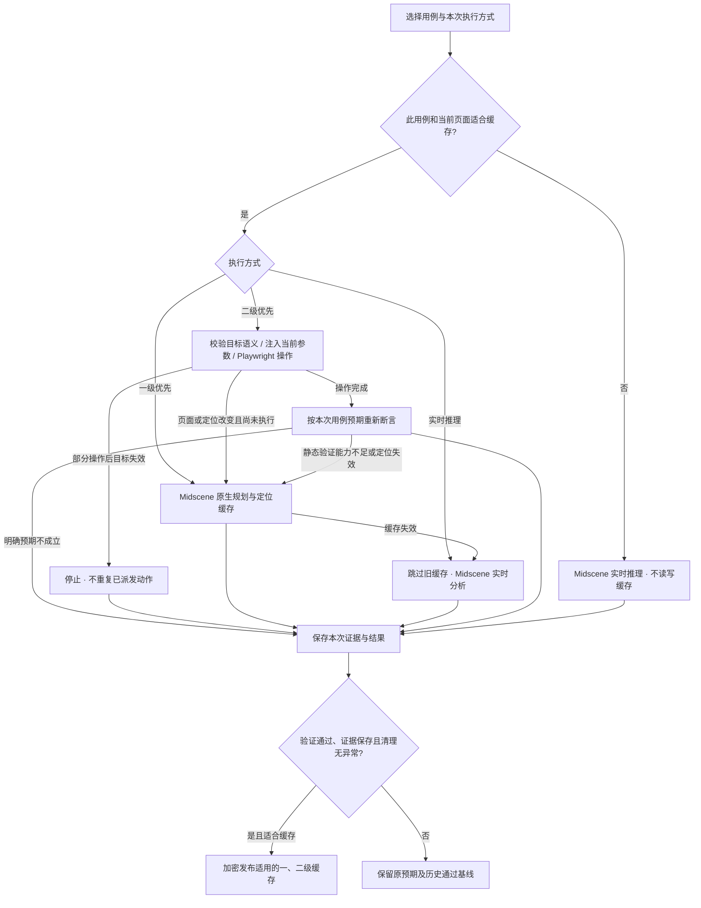

# 用例分层执行与缓存

WeUI 使用用户约定的级别名称：二级是 JSON 操作记录，由 TypeScript 执行器调用 Playwright；一级是 Midscene 原生规划 / XPath 定位缓存。默认顺序为 **二级 → 一级 → 实时推理**。自然语言步骤首次没有缓存时由 Midscene 观察、操作和验证，之后生成可复用的执行记录；已明确配置控件定位和结构化条件的用例，可在二级优先模式下首次直接静态执行。平台保留 JSON，没有增加 YAML 编辑或 TypeScript 脚本导出。

## 用户操作

### 通用的静态验证沉淀（2026-09-16 更新）

优化覆盖所有通用网站用例的登录准备、业务操作、等待、断言和清理，不针对某个登录用例改写预期。

- 已配置的结构化条件和明确的 `文本可见：`、`文本不可见：`、`页面URL等于：` 条件，在二级模式下可直接静态检查。
- 自由文本等待/断言首次由 Midscene 按原句验证。通过后，执行器尝试把完整原句编译为受限 `learned-ui` JSON 检查；模型只能选择程序提供的 DOM 控件，不能生成脚本或任意选择器。
- 等待与断言的完整性以条件实检为准，不受 Midscene 内部 Sleep 等轮询动作的录制影响。历史上已通过并沉淀、但误标不完整的只读条件，可重新实检后恢复复用；写操作仍要求完整录制。v3 编译器兼容 v2 成功检查，并重新尝试旧版本拒绝的条件。
- 普通 UI 用例中的“正确数据”是输入前提，不自动扩展为后台安全审计；登录结果可由登录后界面和用户/机构标识验证。若原句明确要求数据库事实、权限隔离或指定身份，则必须保持这些要求，不能用普通登录界面替代。
- v5 编译器同时读取当前运行已完成的步骤记录（不包含输入值），把前置步骤依赖和 UI 条件一起保存。回放先核对本次已完成步骤的阶段、键和动作类型；缺少依赖时回到原始验证，不能只看结果页面判通过。已生成的 v2/v3/v4 条件保持兼容。
- 模型输出格式、引用控件或固定预期值不合格时，提供具体校验错误并最多纠正一次；纠正后的完整条件仍须独立复核和页面实检。可恢复的编译失败最多在两次成功运行中自动尝试；同次运行不重复尝试相同预期。语义确实不支持则继续 AI。用户明确选择实时推理时可重新沉淀，不无限重试。
- 缓存仍按环境地址与配置版本隔离。地址变更不会因为截图相似就自动共用原环境的登录状态、定位或验证基线；新环境首次建立自己的缓存后再复用。
- 编译必须覆盖原句、固定预期值必须来自原句，并经过独立模型复核和真实 DOM 实检。控件绑定是缓存适用条件；后续每次重新检查 URL、目标唯一性/可见性/身份及全部条件，不复用 PASS。
- 当前自动编译范围包括文本、值、勾选、启用/禁用、信息非空和页面位置。复杂视觉、否定关系、任意或条件、后台事实等不能完整表达的要求保留原始 AI 验证。既有表单反馈专用编译器继续有效；人工结构化配置仍支持更广泛的 AND/OR、隐藏、数量等条件。
- 同次运行可复用已经编译的条件定义，例如登录等待后再检查相同条件，仍重新读取当前页面。认证、用例和清理使用独立缓存通道，避免相互错用。
- 条件或控件变化时顺序仍为二级 → 一级 → 实时推理；一级不支持等待/断言时记录未命中原因后进入原始 AI 验证。明确人工结构化预期失败仍直接判失败。
- 只有原始用例通过、证据已保存且清理成功，候选记录才发布。失败不会“教会”缓存新的业务预期。原始用例文本、版本和历史结果均保持原样。

首次学习包含编译与复核调用，可能比旧实现多消耗 Token；目的是摊薄后续重复运行成本。零 Token 取决于整条用例的所有阶段是否可静态完成，不能保证任意自然语言用例都可零调用。AI 编译与复核并非形式化正确性证明，测试人员仍可在二级详情检查原句、条件和绑定，复杂业务应明确配置独立断言。

报告区分“缓存失效回退次数”和“为什么本次仍使用 AI”，列出阶段、原因与是否已沉淀；没有旧缓存而直接进入 AI 不属于失效回退。用例能力列表还显示登录阶段的静态覆盖与未覆盖原因。二级详情包含 `learning` 和 `learned-ui` 内容。

用例库每行显示「一级已缓存 / 未缓存」「二级已缓存 / 部分缓存 / 未缓存」。状态按当前用例版本、登录配置和所选浏览器读取，实际执行还会核对页面及浏览器版本。已有历史通过报告不会自动视为有缓存；首次运行新执行器才会采集脚本。

点击一级或二级状态可打开右侧缓存详情。一级显示原生定位及规划中的定位描述，可校准 XPath / 定位描述；二级显示语义定位、目标校验条件、参数来源和诊断用页面指纹，可修改 CSS 定位。修改 CSS 后以该 CSS 为当前定位，但仍须通过原目标语义校验；目标的业务含义不能靠编辑缓存改写。输入值继续绑定用例 / 登录配置，动作类型和原始预期不允许从缓存编辑器改写。

保存使用生成版本（generation）校验。人工修改一级会让二级操作重新采集；人工修改二级会保留可回放动作，但禁用旧的静态断言。下一次必须按用例的原预期重新验证：结构化条件可直接检查，自然语言预期通过 Midscene 重新校准。通过后才生成可用于静态验证的新基线。并发运行发布不会覆盖用户刚保存的新版本。

「更新记录」保留最近 20 次内容更新，显示操作位置、字段名、更新前后值、来源运行 / 操作人。输入数据与敏感上下文不进入公开差异。内容未改变的缓存只续期，不新增内容变更记录；更早的旧缓存没有可追溯的字段差异，不补造历史。

运行所选、单条立即测试、运行入口和报告的一键回归都可以选择：

| 方式 | 读取顺序 | 验证通过后 |
|---|---|---|
| 二级缓存优先（默认） | Playwright 静态脚本 → Midscene 缓存 → 实时推理 | 更新适用的一、二级缓存 |
| 一级缓存优先 | 跳过二级，先读 Midscene 缓存；未命中则实时推理 | 重建二级脚本，并保留/更新一级缓存 |
| 实时推理 | 不读取任何旧缓存，每一步实时分析 | 从本次操作与验证重新构建一、二级缓存 |

用例编辑中可设置「此用例始终实时推理，不读写缓存」。该设置优先于本次运行方式。执行器也会检查当前页面：可见 Canvas / WebGL、iframe、可能使用封闭 Shadow DOM 的自定义元素、大型或带动画的 SVG 等场景保守使用实时推理。这是保守筛查，不能可靠识别所有封闭组件或业务动态语义；测试人员仍可按用例特点固定实时策略。

## 当前实现

- `packages/executor/src/execution-cache.ts`：用例缓存身份、原生缓存恢复、执行统计、通过后发布。
- `packages/executor/src/static-replay.ts`：静态指令记录和回放、页面指纹、缓存适用性检查。
- `packages/executor/src/static-target.ts`：语义定位、URL / 目标身份校验、运行参数模板。
- `packages/executor/src/static-checks.ts`：明确预期的确定性解析与重试验证。
- `packages/executor/src/learned-check.ts`：原始自然语言条件的受限编译、完整性复核、DOM 绑定与重复实检。
- `packages/contracts/src/static-ui.ts`：控件定位、数据参数、等待与断言的受限 JSON 合约。
- `packages/executor/src/structured-check.ts`：结构化条件轮询检查，包含 AND / OR 组合。
- `apps/web/components/structured-editor.tsx`：用例与探索草稿共用的可视化编辑器。
- `packages/executor/src/feedback-check.ts`：表单错误反馈的完整语句解析、验证绑定和颜色 / 图标 / 关联检查。
- `packages/executor/src/browser.ts`：按操作路由 L2 / L1 / AI，统一预算、取消、权限与写操作记录。
- `packages/executor/src/web-case.ts`：认证、步骤、断言、证据、清理与缓存发布。
- `ExecutionCache` 表：加密保存原生缓存和静态指令，保留来源运行、版本、生成时间与有效期。

一级使用项目锁定的 Midscene 1.12.6 原生 `TaskCache`，以只读策略运行并从加密数据库装入内存；执行中的候选内容不自动写入公共 YAML 文件。验证通过后统一发布。当前 SDK 不缓存 `aiAssert` / `aiQuery` / `aiWaitFor` 的判断结果；这类步骤在二级无法验证时，记录一级不可用的原因，再由实时推理检查原预期。

一级缓存还按认证 / 用例阶段、步骤序号和原指令隔离。同一句「点击提交」出现在不同步骤时，不会共用消费游标；混合二级和一级回放时也不会错取前一个页面的定位。

二级使用带检查点的静态 Playwright 指令结构，由固定解释器执行，不执行模型生成的任意 JavaScript。显式步骤支持点击、输入、下拉选择、设定勾选状态、悬停和按键；自然语言组合步骤当前仍只自动提取点击与输入。输入绑定本次参数，登录凭据不会成为静态脚本字面量。

## 结构化静态能力（2026-09-16）

在「用例库 → 编辑校准」右侧抽屉中配置，也适用于探索草稿的审核编辑。

| 操作 | 静态支持范围 | 校验与边界 |
|---|---|---|
| 点击 | 按钮、链接及可定位的 DOM 控件 | 目标唯一、可见、可操作；点击完成不代表业务通过 |
| 输入 / 清空 | 文本、密码、数字、日期/时间、多行文本、contenteditable | 留空表示清空；核对结果等于本次输入 |
| 下拉选择 | 原生 select 按文本或 value；ARIA combobox / listbox 按选项文本 | 原生选项须唯一且启用；自定义下拉须有唯一可见 role=option；打开后找不到选项则停止，不重复打开 |
| 勾选 / 取消 / 单选 | 原生 checkbox/radio、带明确 aria-checked 的 checkbox/radio/switch | 设定目标状态，已满足时不再点击；不支持取消单选或猜测 mixed 状态 |
| 悬停 | 可唯一定位的 DOM 控件 | 后续用等待或断言检查菜单/提示是否出现 |
| 按键 | 面向目标控件的 Enter、Tab、Shift+Tab、Escape、Space、方向键、Home/End、Backspace/Delete | 固定按键白名单；不允许任意脚本或系统快捷键 |

勾选「指定控件定位，优先静态执行」，可按字段标签、角色与名称、可见文本、占位提示、测试 ID 或 CSS 定位。未配置定位时，新增的选择/勾选/悬停/按键步骤通过 Midscene 定位后执行相同的受限操作；通过后沉淀为二级指令。复杂、未提供语义的自绘控件仍需自然语言操作，不承诺所有日期弹窗、多选组件、拖拽或图形操作均已支持。

等待步骤可以选择「使用结构化等待条件」，预期结果可以选择「结构化验证」。支持可见/不可见、可操作/禁用、勾选状态、文本包含/完全相等、输入或选中值、元素数量、URL 包含/完全相等；支持最多 10 个叶子条件的 AND / OR。等待默认 20 秒，断言默认 5 秒，可配置 100–30,000 毫秒。通过轮询等待条件成立，不使用固定 sleep 或上一次的通过结果。正向目标要求唯一；元素数量可检查集合；不可见允许目标不存在。

结构化断言来自人工维护的用例版本，是明确的业务预期。条件不成立会保留失败，不自动把新页面内容变成期望值。自然语言预期通过后可经受限编译或已有反馈句式生成静态记录；不能完整表达的视觉要求仍由 Midscene 判断。

「测试数据参数」当前保存用例级参数，例如 `name = 回归-{{runId}}`，在输入、选项、定位、入口、等待和预期中使用 `{{data.name}}`，也支持 `{{runId}}` / `{{caseId}}`。参数跟随运行快照固定，执行时替换为本次值；缺失参数在保存及执行前检查，不允许表达式求值或参数递归引用。本次尚未增加数据表批量运行或运行时覆盖参数的界面。凭据继续使用登录配置。

用例库的「执行能力」可展开逐项查看：可直接静态操作、可直接静态验证、首次需 AI 定位/规划、需要 AI 判断或校准，以及已有二级记录。运行报告显示实际使用的二级、一级或 AI 路径；标题统计「二级静态执行」，直接按明确条件执行会另外注明，避免将首次执行说成缓存命中。是否零 Token 取决于登录、业务和清理全过程；清理使用独立通道沉淀，不混入业务步骤记录。

JSON 条件比较按规范化内容进行，不受数据库字段顺序影响；输入中的运行 ID 变化不使结构化预期失效。旧用例、自然语言预期和旧报告可继续使用，无需迁移。

新版校验分开处理操作、数据和业务预期：

1. **操作入口与目标**：每个动作核对 URL；优先使用精确 label、role/name、testId、placeholder，必要时使用 CSS。目标须唯一、可见、启用，并通过 Playwright 的操作前检查。核对元素类型、标签、名称、按钮文本、链接地址及表单上下文；有语义定位时不依赖动态 DOM ID。没有可靠身份的匿名元素不沉淀为二级操作。
2. **本次输入**：显式输入从当前步骤或登录配置注入；内嵌动作中的运行 ID 保存为 `{{runId}}` 模板。输入后等待字段值等于本次参数；不与上次输入比较。若应用拒绝或改写该值，停止并报告输入后置条件失败，不重放输入。
3. **业务验证**：点击成功只表示操作已派发，不能代表业务通过。每次从当前运行固定的用例预期重新验证，不复用历史 `passed`。可确定表达的预期由 Playwright 重试检查；支持的表单反馈可以生成包含文本、表单和外观关联的完整验证记录，其余语义继续按二级 → 一级 → 实时推理处理。

当前确定性预期支持以下显式格式，可填写在用例验证条件或等待步骤中：

| 格式 | 含义 |
|---|---|
| `文本可见：提交成功` | 精确文本匹配，必须只有一个可见目标 |
| `文本不可见：提交失败` | 没有可见的精确文本匹配 |
| `页面URL等于：https://example.test/#/result` | 当前完整 URL 精确相等 |
| `登录表单显示 Incorrect Login Account or password 错误提示` | 支持表单反馈句式；首次按原句实时验证后绑定提示及所属表单，下次重新检查 |
| `登录表单仍然可见，显示红色警告 Incorrect Login Account or password，旁边有三角感叹号图标` | 在上述检查基础上，保存并重新核对警告区域颜色、SVG 形状和图像、图标与文字相邻关系 |

支持在预期中使用现有的 `{{runId}}` / `{{caseId}}` 运行变量。这些明确句式可直接静态检查；其他自然语言通过通用编译或专用反馈编译器沉淀，不能从观察结果生成替代预期。之后二级命中仍重新检查，断言默认等待 5 秒、等待步骤默认 20 秒。人工明确的确定性断言失败直接保留失败结果；自动学习记录不适用时调用原始预期重新验证。静态检查来源为 `PLAYWRIGHT_ASSERTION`。

表单反馈使用完整句式识别，消息文本和表单名称来自原始预期，没有特定网站选择器。首次原始 Midscene 验证通过后，才会绑定唯一错误文本、HTML form、语义字段、role=alert 警告区域和一个相邻 SVG 图标。外观记录不包含输入值或整页截图；每次输入不同的 `{{runId}}` 不影响这些检查。缓存 `check.intent` 保留完整预期，`check.binding` 保存经过验证的关联记录。不能完整解析的附加条件、不能可靠关联的结构不会生成部分断言冒充完整覆盖。

文字缺失、表单字段隐藏等明确不满足预期的情况保留失败结果。颜色、图标渲染或定位关系变化意味着静态检查无法确认，先进入一级，再由实时推理核对原始预期；只有原预期仍通过才重新绑定。这样可以接受实际合理的页面变化，也能报告真实缺陷。局部图标渲染的严格比对可能产生额外回退，不承诺任意视觉断言都能零 Token。

整页截图和 DOM 指纹继续作为诊断信息保存，但不再作为二级复用或判定业务通过的门槛；其变化不计入新版执行规则的字段差异。尚无完整静态验证记录时，用例显示「二级部分缓存」。完整操作、等待、断言及登录准备都能静态执行时，该次运行可零模型调用、零 Token；默认仍允许逐级回退，不提供“禁止模型调用”的保证。

缓存格式升级为 `weui-execution-cache-3`。旧版记录仍可查看，历史报告保持不变；新版执行不读取旧版页面指纹策略，首次运行通过后自动建立新缓存。

缓存身份绑定工作空间、网站配置、用例和功能版本、登录配置版本、原预期和上下文、模型、浏览器及其版本、视口、SDK 和执行器版本。默认有效期 7 天；更新使用生成版本比较，避免并发覆盖。

## 回退与结果边界

回退发生在步骤级，不能把已经提交的整个用例重新跑一遍。默认严格按 **L2 静态回放 → L1 原生规划 / 定位缓存 → AI 实时推理**：先尝试二级；二级定位或验证能力不可用时尝试一级；一级缺失、不支持或失效时才实时分析，并分别保存路由原因。一级命中后无需为同一个动作再调用模型。

目标未匹配且尚未派发当前步骤的动作时才允许重新定位。多动作步骤部分完成后，下一目标或入口失效，会停止并记录待核对结果；不会自动重复可能产生业务影响的动作。业务断言失败不属于定位缓存失效。

只有整条用例验证通过、证据已保存且清理未失败，才发布新缓存。失败、证据不足、取消、部分动作未知等结果不会把新页面学成正确答案。缓存不可用时也不能跳过实时验证。普通网站的页面验证仍不等价于数据库事务或账务正确性。

运行报告显示二级命中、一级命中、实时推理、回退次数及实际原因。缓存命中仍保存本次截图、工具动作和验证来源，费用使用本次实际模型调用量计算。

“有二级缓存”不等于本次一定命中，但访客登录账号中的 `{{runId}}` 正常变化不再单独触发回退。真正的入口改变、目标缺失 / 重名、语义改变、遮挡或不可编辑仍需回退或停止。报告分别记录静态操作数量、二级命中和实时验证，显示具体原因；旧报告注明旧版校验机制。

## 单用例性能与历史

结果页按用例显示耗时、输入 / 输出 Token、模型调用次数和人民币预估费用。Worker 在顺序执行每个用例前后记录用量增量，包含该用例的登录准备、操作、验证、清理，不包含整批浏览器启动或计划生成。人民币费用取该运行的模型计价记录，零模型调用显示 ¥0；未知或非人民币计价不当作免费。

历史趋势按用例 ID 查询，默认所选浏览器，可切换全部浏览器；按执行顺序展示耗时、Token、费用三条趋势，点击点或明细时间可打开对应报告。包含历次用例版本，明细保留版本、执行方式和命中量。每页 30 次，可加载更早记录。旧单用例运行从原有总量读取并标注来源，旧批量运行未采集的分项显示“未记录”，曲线不跨缺失值连线。

接口：`GET /api/execution-caches/:id`、`PATCH /api/execution-caches/:id`、`GET /api/web-cases/:id/history`。均校验网站所属项目成员权限。缓存内容继续加密保存在 `ExecutionCache`；字段差异保存在 `AuditEvent`，用例指标保存在 `Run.summary[].metrics`，不需要迁移旧数据。

官方依据：[Midscene 缓存与 XPath 局限性](https://midscenejs.com/zh/caching)、[Playwright 定位](https://playwright.dev/docs/locators)、[Playwright 操作前检查](https://playwright.dev/docs/actionability)。

本次实测与验收命令：[分层执行缓存验证记录](分层执行缓存验证记录.md)。
