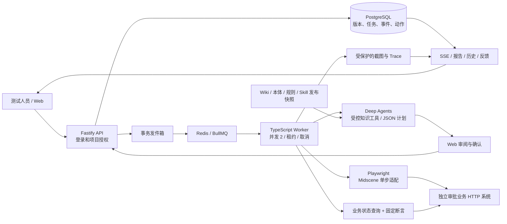

# TraceLab UI Agent MVP 开发与功能验证报告

> 本文保留 v0.1 历史结果。2026-09-14 已交付网站自助接入和全 Midscene UI 执行，最新范围与验证见 [v0.2 报告](Midscene网站自助测试开发与验证报告.md)。下文旧版框架和未完成项不代表当前状态。

版本：0.1.0 · 日期：2026-09-13 · 最终规划提示词：ui-planner-1.0.1。

已交付可以在本机使用的 TypeScript Web MVP。用户可完成登录、输入目标、审阅计划、确认执行、查看业务断言与证据、提交反馈，以及自定义 Skill 的调试、发布和回退。后台使用真实 Deep Agents 模型调用和真实 Chromium 浏览器执行。

**交付范围为独立审批样例。企业系统接入、Midscene 视觉模型实测、内部 HTTPS 和真实测试人员试用仍未完成，不能据此宣布所有 P0 企业发布门槛通过。**

## 1. 使用入口与代码

- 本机 Web：http://localhost:3100，当前以生产构建运行。
- 随机受邀账号：[本机访问文件](../.runtime/access.local.md)。不在本文复制密码。
- [启动说明](../README.md)、[运行手册](../docs/operations.md)、[开发任务与迭代路线](./MVP开发任务清单与迭代路线.md)。
- Web、API、Worker、审批样例均已实现；数据库迁移、种子知识、环境配置、容器模板、CI 工作流和验证脚本已纳入仓库。

实际依赖锁定：Next.js 16.3.5、React 19.3.0、Fastify 5.12.4、Deep Agents 1.13.4、Playwright 1.63.0、Midscene 1.12.6、Prisma 6.19.3、BullMQ 6.3.4。此次原生环境为 Node.js 24.9.0、PostgreSQL 17.11、Redis 8.10.1；浏览器使用本机 Microsoft Edge 的 Chromium 引擎。

## 2. 已实现的运行方式

Deep Agents 生成注册场景的选择与解释，服务端校验范围并装配固定步骤和独立断言。用户确认后锁定计划 revision、知识、Skill、工具、断言、模型和预算。Worker 执行有限场景循环；模型不会直接决定业务 PASS，也不能获得框架默认的任意文件系统或执行工具权限。

知识包包括 6 篇 Wiki、10 条规则和场景到规则的本体关系。文本 Skill 支持复制模板、修改说明和场景、校验依赖、隔离调试、管理员发布和回退。工具中心提供受控 SDK 与审批业务 HTTP 适配器；凭证在服务端注入。

## 3. 功能验证结果

| 验证层 | 实际结果 | 验证内容与证据 |
|---|---|---|
| 类型检查与生产构建 | 通过 | `pnpm typecheck`、`pnpm build`，Next.js 静态工作台构建成功 |
| 单元验证 | 10/10 通过 | 固定预期、非法场景/规则/工具、假成功、越权/重复写入、Trace 脱敏、密码与哈希；`tests/unit/domain.test.ts` |
| 平台集成验证 | 13/13 最终通过 | 主套件 11 项全部通过；知识损坏和清理故障 2 项分别通过修正后的复测；`tests/integration` |
| Web E2E | 4/4 通过，无跳过或重试通过 | 新建/确认/报告/反馈，知识和工具，自定义 Skill 真实模型调试/发布，390px 窄屏与退出；[原始 JSON](../.runtime/verification/web-e2e.json) |
| 健康业务回归 | 36/36 PASS | 12 场景 × 3 轮，每轮 76 个计入预算的工具动作；全部清理完成；[原始结果](../.runtime/verification/business-regression.json) |
| 真实 Agent 评测 | 20/20 符合预期 | 最终提示词重新完成全部评测；DeepSeek `deepseek-chat`，真实模型规划和浏览器执行；[原始结果](../.runtime/verification/agent-evaluation.json) |
| 五会话并发 | 5/5 完成 | 创建 API P95 182ms，确认 API P95 198ms，终态显示延迟 P95 1168ms；同时运行上限 2；[原始样本](../.runtime/verification/concurrency.json) |
| 全部本机服务重启 | 通过 | 重启 Web/API/Worker/样例及项目独立 PostgreSQL/Redis；报告、运行快照与受保护截图哈希保持一致；[重启结果](../.runtime/verification/restart.json) |
| 备份与还原 | 通过 | PostgreSQL 一致性导出快照还原到临时数据库，核对 88 个任务、76 次运行；备份 249 个证据文件并抽查 30 条证据路径；[还原结果](../.runtime/verification/backup-restore.json) |

五会话是自动化浏览器会话，同一台开发机完成，不是五名真实测试人员，也不能外推为生产容量。业务回归和 Agent 评测分别统计，受控故障不计入健康回归完成率。Agent 评测主要通过注册场景 ID 指定目标，验证规划契约和判定链路，不能据此推导任意新页面的泛化能力。

平台集成实际检查：会话和项目隔离、跨站写入拒绝、测试人员管理权限、过期计划版本、三次并发确认只创建一次 run、事务发件箱、SSE 游标续看、受保护证据下载、反馈不改写原结论、执行和环境开关、未配置视觉模型、工具目标/命名空间限制、运行中取消、取消后迟到写入隔离、失联租约回收、未知写入禁止重放、Skill 发布/锁版本/回退、未发布及损坏知识阻断、清理故障及对账。

## 4. 20 项 Agent 评测明细

| 类别 | 数量 | 预期与实际 |
|---|---:|---|
| 健康正常、边界、权限、幂等、租户场景 | 8 | 8 项 PASS |
| 假成功提示、缺失表单校验、普通用户越权、自审批越权、重复提交、错误状态 | 6 | 6 项 FAIL，关键误通过为 0 |
| 查询接口不可用及写入后预算不足导致证据缺失 | 3 | 3 项 INCONCLUSIVE |
| 不同执行阶段的动作预算不足 | 3 | 3 项 BLOCKED |

首个业务失败与证据被保留，没有通过重试隐藏错误。独立清理故障验证中，业务断言可以为 PASS，同时运行状态为 ERROR、清理状态为 FAILED，页面明确显示问题并拒绝重跑。随后对该 run 的命名空间执行维护对账，保留原始故障结论和审计记录。

## 5. 本次修正的关键问题

- 空 DELETE 请求携带 JSON Content-Type 导致业务清理失败；已按是否存在请求体设置请求头。
- 取消请求后迟到的业务写入可能越过清理；样例业务通过命名空间锁与关闭检查阻止迟到写入。
- 不传 parentRunId 可能绕过未知副作用检查；重新执行现在必须引用最近一次运行。
- Trace 字符串脱敏曾截断长快照；改为完整脱敏，保留可回放内容，下载前检查项目授权。
- 并行验证曾触发过紧的请求限流；调整为每 IP 每分钟 1200 次，客户端遵循 Retry-After 并降低轮询频率。
- Skill 调试暴露模型非 JSON 输出与虚构前置条件缺口；采用 JSON 输出模式，限制为知识工具，并明确完整场景内已包含准备、首次提交和清理语义。最终 Web 和 20 项 Agent 评测重新通过。[DeepSeek JSON 输出约定](https://api-docs.deepseek.com/guides/json_mode/)

## 6. M01–M28 状态对照

“本机通过”表示实现及样例范围内验证成立；原任务依赖的真实业务、QA 和运维验收仍按原发布门槛执行。

| 任务 | 当前实现状态 | 剩余验收 |
|---|---|---|
| M01 业务链路冻结 | 12 场景审批样例已提供 | 真实系统、业务 QA 规则与账号未提供 |
| M02 TS 工程与环境 | 本机通过；容器与 CI 文件已提供 | 新部署主机、容器和 CI 实际运行 |
| M03 共享契约 | 本机通过 | 新业务适配时扩充契约 |
| M04 数据库与发件箱 | 本机通过 | — |
| M05 登录与项目授权 | 本机通过 | 企业身份系统留待后续 |
| M06 Web 创建任务 | 本机通过 | 当前角色按注册场景固定 |
| M07 计划确认和幂等 | 本机通过 | — |
| M08 队列、心跳和租约 | 本机通过 | 真实共享账号池租约需适配 |
| M09 模型和预算 | 真实模型已通过 | 严格费用硬限额由模型网关配合 |
| M10 知识快照 | 6 Wiki / 10 规则 / 本体已通过 | 企业 QA 审核与知识包 |
| M11 SDK + HTTP 工具 | 审批适配器已通过 | 真实业务接口适配 |
| M12 角色与数据隔离 | 样例已通过 | 真实账号、对象和清理接口 |
| M13 浏览器执行与证据 | 真实 Chromium 执行已通过 | 真实页面接入 |
| M14 Midscene 视觉单步 | 适配、开关、网关与 usage 已实现 | 视觉模型凭证/型号与真实控件实测；未验收 |
| M15 独立业务断言 | 36 健康回归与故障反例通过 | 企业规则对应 oracle |
| M16 Deep Agents 规划与循环 | 真实规划和受控执行通过 | M14 及真实环境依赖仍待验收 |
| M17 计划审阅 | 本机通过 | — |
| M18 SSE 与持久事件 | 本机通过 | 内网反向代理环境复测 |
| M19 实时运行页与取消 | 本机通过 | 视觉费用暂无价格表 |
| M20 报告、证据、缺陷草稿 | 本机通过 | 未向外部平台自动提交缺陷 |
| M21 异常收尾与未知副作用 | 本机通过 | 真实系统对账/补偿规则 |
| M22 历史、重跑、反馈 | 本机通过 | — |
| M23 文本 Skill 自定义 | Web 复制、编辑、依赖与调试通过 | 不支持用户任意脚本 |
| M24 Skill 发布与回退 | Web/API 通过 | 真实 QA 独立试用确认 |
| M25 知识/工具/管理目录 | 本机通过 | 工具注册仍由维护者开发 |
| M26 平台和 Agent 验证 | 自动化结果如上 | 企业环境和真实用户门槛 |
| M27 部署、备份与恢复 | 本机重启、备份还原通过 | 内部 HTTPS、容器演练、告警接入和部署 owner |
| M28 试用与正式发布 | 使用引导、受邀账号、反馈和手册已提供 | 5–10 名真实用户与企业发布签收 |

## 7. 下一阶段接入所需信息

1. 一条真实业务链路的测试 URL、申请人/审批人角色、数据准备/查询/清理接口，以及 QA 确认的 12 项预期。
2. Midscene 支持的视觉模型名称、模型族和网关；凭证通过部署环境配置。
3. 内网部署主机、域名/证书、告警接入方式、维护负责人和首批试用人员。

新增业务需要注册相应适配器。MVP 当前不开放任意目标地址、MCP 自助安装、任意脚本、跨项目 Skill 分发、Wiki 自动摄取或自主探索新业务流程。完整功能继续按 v0.2–v1.0 的迭代清单推进。

模型单价未设置时显示“未知”，token/次数/时间预算仍检查；单次请求的实际 token 消耗需等待供应商返回，因此不能把应用预算视为供应商计费硬上限。视觉模型尚未配置，最终验证没有把 Playwright 点击冒充 Midscene 点击。

## 8. 主要产物

- [Web 组件](../apps/web/components/workbench.tsx)、[API](../apps/api/src/index.ts)、[Worker](../apps/worker/src/index.ts)。
- [Deep Agents 规划器](../packages/agent/src/index.ts)、[浏览器执行器](../packages/executor/src/index.ts)、[独立断言](../packages/assertions/src/index.ts)。
- [数据库迁移](../packages/db/prisma/migrations/202609130001_initial/migration.sql)、[容器模板](../deploy/compose.yaml)、[CI](../.github/workflows/verify.yml)。
- [计划审阅截图](../.runtime/screenshots/plan-review.png)、[真实运行报告截图](../.runtime/screenshots/run-report.png)、[知识库截图](../.runtime/screenshots/knowledge.png)、[Skill 截图](../.runtime/screenshots/skill-detail.png)。

原设计 PDF 和点击原型继续保留为方案资料；本报告与 `.runtime/verification` 才是本次开发验证记录。
