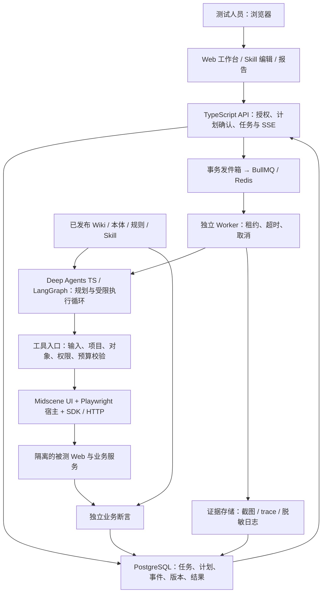
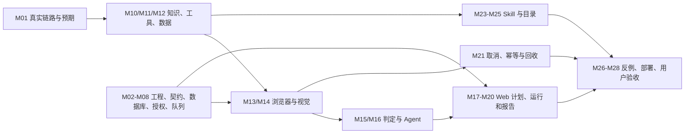

# UI Agent Web MVP 开发任务清单与迭代路线

> 2026-09-15 当前实现：已按最新要求切换为 **Midscene PlaywrightAgent + Playwright**，支持 Chrome（默认）、Edge、Firefox。网站及用例执行页可选择浏览器，运行快照固定选择供回归。下文 2026-09-14 的 Puppeteer 选择与历史验收记录已被此次迁移取代，当前实现与限制见 [运行手册](../docs/operations.md)。


2026-09-14 探索增量：新增独立 Web 探索入口、需求文本/Markdown 导入、阶段基线准入、Deep Agents 导航规划、Midscene 页面观察与截图、操作与路径双层收敛、独立草稿编辑/驳回/审核发布、已发布用例创建正式测试任务。已实现项及使用限制见 [探索指南](../docs/网站探索与用例沉淀.md)。

| 增量任务 | 状态与验收边界 |
| --- | --- |
| 网站和需求创建探索任务 | 已实现；保存需求与知识快照，复用队列、取消、预算和租约 |
| 主链路 → 边界 → 发散 | 已实现阶段准入；通过上一阶段审核用例的正式执行记录推进 |
| 动作、路径双层收敛 | 已实现：历史动作上下文、重复操作拒绝、相似状态不计新覆盖、新路径优先 |
| 页面观察和草稿来源 | 已实现；真实截图、需求/领域规则引用、假设与未覆盖项；允许无新用例结果 |
| 人工编辑、审核、发布、正式测试 | 已实现；独立草稿库、版本冲突检测、审计及幂等发布 |
| 探索时直接填写和提交表单、按钮/弹窗状态图 | 后续；本版在人工审核后的正式测试中执行这些动作 |
| Word/PDF 解析、大规模覆盖图、跨次探索自动去重 | 后续；本版正文粘贴/TXT/Markdown，单次最多 8 页，带上阶段基线上下文 |

2026-09-14 补充交付：网站管理、登录会话配置、功能 / 用例编辑、通用浏览器执行已开发，执行层和 Web E2E 统一改为 Midscene。包含登录凭证加密、会话导入、版本锁定、步骤编辑、页面断言、报告和清理状态。实际使用流程见 [接入指南](../docs/网站接入与测试指南.md)。业务系统后台证据适配、MFA 人工接管、文件上传、跨用例角色编排和通用网站 Skill 发布仍需后续迭代。

版本：v1.1 | 日期：2026-09-13 | 状态：已交付可本机体验的 MVP；企业发布验收待完成。

本清单落实已确认的三个约束：**用户通过 Web 使用、后台采用 Agent 架构、核心开发语言为 TypeScript**。与总方案 v1.4 配套；涉及开发优先级、交付范围、资源和节奏时，以本清单为准，替代此前“八周工程试点、门户后置”的安排。当前仓库已包含 Web、API、Worker、独立审批样例及验证代码。安装和启动见 [README](../README.md)，逐项实现状态和实测结果见 [MVP 开发与功能验证报告](./MVP开发与功能验证报告.md)。

## 1. 先交付什么

第一版交付一个可以访问的内部 Web 工作台，让 5-10 名受邀测试人员针对 **1 个真实测试环境、1 条业务链路** 完成：登录 → 输入测试目标 → 查看规则与测试计划 → 确认执行 → 观察进度 → 查看业务断言和证据 → 反馈问题。用户无须安装 Node、编辑仓库文件或运行命令行。

建议先选“申请创建、提交与审批”或同等规模的业务链路；这是范围示例，开工时由业务 QA 用真实规则替换。MVP 只支持 Chromium、预配置测试环境和账号角色，先跑 12 个代表业务用例，覆盖正常、权限、边界和重复提交。多项目、多浏览器和复杂探索在后续迭代交付。

**MVP 必须包含最小知识库、可在 Web 自定义的文本 Skill、受控工具接入和真实业务判定。** 知识库先发布少量规则快照；Skill 先复用模板和已接入工具；工具先提供 SDK 与一个业务 HTTP 适配器。完整 Wiki 编辑与摄取、MCP 自助配置、脚本运行器逐步扩展。

可以提前提供可重置样例应用帮助开发、演示和故障注入，但样例通过不能替代真实环境接入验收；原来的点击演示也不计入 MVP 完成度。

### MVP 范围冻结

| 能力 | v0.1 MVP 必须交付 | 后续扩展 |
| --- | --- | --- |
| 使用入口 | 内部 HTTPS 地址、受邀登录、项目授权、任务列表与详情 | 企业统一登录、组织管理、多项目协作 |
| 创建任务 | 目标、预配置环境、角色、知识快照、Skill、预算 | 文档批量导入、需求平台同步、定时任务 |
| Agent | Deep Agents TS 生成结构化计划，工具执行有边界，失败有解释 | 变更分析、覆盖驱动探索、独立分析任务并行 |
| 浏览器执行 | Midscene UI 操作、视觉断言、Playwright 隔离会话 | 多浏览器、复杂页面、自适应恢复 |
| 结果判定 | 注册的程序断言、来源规则、五类结果、首次失败证据 | 更丰富业务适配器、跨系统和异步业务核验 |
| 知识库 | 一条链路的 Wiki/本体/规则快照；Web 阅读与引用 | Web 编辑、LLM 摄取草稿、评审、影响分析 |
| 自定义 Skill | 两个模板；Web 复制、编辑文本、调试、提交发布；管理员发布和回退 | 自动生成草稿、复杂依赖、跨项目分发、质量排行 |
| 工具 | SDK + 一类 HTTP；后端注册、Web 展示与健康状态 | HTTP/OpenAPI 自助接入、MCP、受控脚本 |
| 运行体验 | 异步队列、状态流、刷新重连、取消、历史和反馈 | 更多并发、长任务安全恢复、配额与运营看板 |
| 交付 | 真实运行报告、截图/trace、缺陷草稿下载、内部部署和支持说明 | 用例代码入库、CI 门禁、缺陷平台写入 |

基础授权、断言可信、取消清理和证据留存属于 MVP 发布条件。赶进度时缩小业务覆盖与集成类型，保留这些条件。

## 2. TypeScript 技术栈与工程结构

以下是项目实施选择，尚未通过本项目性能实测。初始化时锁定兼容的稳定版本、Node 运行版本及容器镜像，保留 lockfile；不使用浮动 latest 或预览能力作为交付前提。

| 部分 | 采用方案 | 具体职责 |
| --- | --- | --- |
| Web | React + Next.js App Router + TypeScript | 表单、计划确认、运行时间线、报告、Skill 编辑；复用一套基础 UI 组件 |
| API | Node.js + Fastify + TypeScript | 登录会话、项目授权、任务命令、资源查询、SSE；业务逻辑集中于此 |
| Agent | Deep Agents TypeScript；底层 LangGraph | 知识使用、计划、有限重规划、报告解释；固定 schema 和工具范围 |
| Worker | Node.js + Midscene SDK + Playwright 宿主 | 运行 Agent、持有浏览器 context、调用业务工具、断言与清理 |
| 数据 | PostgreSQL + Prisma；数据库迁移纳入版本 | 任务、计划、事件、结果、资产发布与反馈；事务和唯一约束保证一致性 |
| 排队 | BullMQ + Redis | 投递与调度；业务任务状态以 PostgreSQL 为准，重复投递由应用去重 |
| 证据 | 既有对象存储接口；开发环境可用受控本地卷 | 截图、trace、脱敏日志、知识源文档；下载前鉴权 |
| 知识资产 | Markdown + JSON/YAML + Git 版本化发布包 | Wiki、轻量本体、正式规则、Skill 源包；数据库存发布索引 |
| 质量与交付 | TypeScript 检查、契约/状态测试、Midscene Web E2E；容器化 | CI 验证，内部环境部署，数据库/证据备份与升级回退 |

技术能力依据：[Next.js App Router](https://nextjs.org/docs/app)、[Fastify](https://fastify.dev/docs/latest/)、[Deep Agents TS](https://docs.langchain.com/oss/javascript/deepagents/overview)、[Prisma](https://github.com/prisma/orm)、[BullMQ](https://docs.bullmq.io/)、[Midscene 与 Playwright 集成](https://midscenejs.com/zh/integrate-with-playwright)。这些组件负责不同层次，不代表框架自动提供本清单中的产品能力。

```text
apps/
  web/                  # Next.js 用户与管理员界面
  api/                  # Fastify HTTP/SSE 服务
  worker/               # Agent、浏览器、业务工具与独立验证
packages/
  contracts/            # DTO、运行时 schema、事件、结果和错误码
  agent/                # Deep Agents 配置、状态和阶段策略
  executor/             # Midscene UI、Playwright 会话与动作封装
  tools/                # SDK/HTTP/MCP 适配接口与注册定义
  knowledge/            # 已发布知识的搜索、规则和来源读取
  skill-registry/       # Skill 导入、校验、版本与授权
  assertions/           # 业务断言注册与结果裁决
  db/                   # Prisma schema、迁移和仓储
  config/               # 配置、日志与预算
knowledge/              # 原文清单、Wiki、本体、规则、发布清单
skills/                 # 审核后的 Skill 源包和模板
tests/                  # 确定性回归；子目录 platform 测平台本身
evals/                  # Agent/知识/Skill 独立评测集
deploy/                 # 容器、配置样例、升级回退和运维说明
```

这是建议创建的目录，不是现有应用文件。用一个 TypeScript monorepo 管理；首期部署 Web、API、Worker 三个进程，可共用一台受控主机和已有数据库/存储。Worker 从第一版就与 HTTP 请求生命周期分离，无须先建设微服务平台或 Kubernetes。

## 3. MVP 架构与运行契约



采用一个主 Agent 配合程序阶段节点；浏览器只有一个操作者。规划任务和执行任务分开排队：生成计划后释放 Worker，等待用户在 Web 确认，再提交执行作业，避免等待用户时占用浏览器。

### 状态与恢复边界

任务生命周期：`DRAFT → PLANNING → AWAITING_APPROVAL → QUEUED → RUNNING → COMPLETED`。模型或基础设施故障可进入 `ERROR`；取消经 `CANCEL_REQUESTED → CANCELLED`。编辑已生成计划会产生新 revision，旧确认失效；终态不能被迟到事件覆盖。

用例结果独立记录 `PASS / FAIL / BLOCKED / INCONCLUSIVE / SKIPPED`，并保留 cause。`COMPLETED` 只表示任务结束，不表示业务通过；报告按用例分别展示结果，不把取消、错误或未执行折算为通过。任务为 ERROR/CANCELLED 时，已完成结果保留，未执行项标 SKIPPED，副作用不明的在途项标 INCONCLUSIVE。

MVP 支持刷新页面续看、API 重启后读取、队列去重与 Worker 崩溃后有确定终态。**MVP 不承诺恢复到崩溃前的活浏览器现场**：租约失效先阻止旧 Worker 继续调用，保留证据并结束为 ERROR；对可能已发生的写操作只做受控结果查询，无法确定则 INCONCLUSIVE，用户重新运行会生成关联的新 run。安全检查点恢复在 v0.4 扩展。[LangGraph 持久化](https://docs.langchain.com/oss/javascript/langgraph/persistence)

队列自动重试不等于业务幂等。使用任务提交幂等键、数据库唯一约束、租约 fencing token 和动作账本；业务写操作要有稳定 action_id，并优先使用目标 API 的幂等键。重复投递或未知写入结果时先查账本与目标状态，不能直接重放整段 UI 流程。[BullMQ 幂等作业](https://docs.bullmq.io/patterns/idempotent-jobs)

### 第一周冻结的对象与 API

| 对象 | 最小字段与约束 |
| --- | --- |
| Project / Environment | 成员、角色、允许的目标域名、测试账号引用；环境地址由管理员配置 |
| Task / PlanRevision | 目标、角色、约束、结构化步骤、rule_ids、assertion_ids；确认绑定具体 revision |
| Run / RunManifest | run_id、project_id、计划哈希、知识/Skill/工具/断言版本、策略/模型/提示词/代码/环境/数据版本、预算；执行前不可变 |
| Action / RunEvent | action_id、对象范围、状态、幂等键、seq、attempt、lease_epoch、时间与证据引用 |
| CaseResult / Evidence | 预期、实测、规则来源、result、cause、截图/trace 引用、清理状态；首次失败不可被重试覆盖 |
| KnowledgeRelease / SkillRelease / ToolVersion | 源包哈希、依赖、项目授权、发布状态、owner；草稿与正式版本分离 |
| Feedback / AuditEvent | 用户、run_id、评价、问题分类、补充说明；发布、回退、授权与取消记录 |

建议 API 契约如下，路径是待实现设计：

| API | 行为与验收约束 |
| --- | --- |
| `POST /api/tasks`；`POST /api/tasks/:id/plans` | 创建任务、异步生成计划；返回任务 ID，不同步等待浏览器完成 |
| `GET /api/tasks/:id`；`PATCH /api/tasks/:id/plans/:revision` | 查看或调整计划；修改增加 revision，不能修改已执行的快照 |
| `POST /api/tasks/:id/runs` | 携带 revision 和提交幂等键；鉴权、检查依赖和预算后原子创建 run 与发件箱记录 |
| `GET /api/runs/:id`；`GET /api/runs/:id/events` | 状态和 SSE；持久 seq，支持 Last-Event-ID；事件过期时返回快照和新游标 |
| `POST /api/runs/:id/cancel` | 幂等取消；返回请求已受理，不立即伪报资源已释放 |
| `GET /api/runs/:id/report`；`GET /api/evidence/:id` | 项目授权后返回报告或短时下载地址；不暴露公开存储桶 |
| `GET /api/knowledge/releases/:id`；`GET /api/tools` | 展示授权的规则、来源和工具契约，屏蔽凭证 |
| `POST /api/skills`；`PATCH /api/skills/:id/draft` | 文本草稿编辑、输入输出校验和已注册依赖选择 |
| `POST /api/skills/:id/debug-runs`；`POST /api/skills/:id/releases` | 隔离调试；管理员核验调试记录后发布固定版本 |
| `POST /api/runs/:id/feedback` | 保存体验与结论纠正建议；不修改原始机器结果 |

首期不把框架原始事件直接暴露为产品协议。由 Worker 转成稳定的阶段、动作摘要、证据、费用和错误事件；不显示模型内部思维过程。事件重连按 seq 去重，证据经裁剪/脱敏后才能发送到浏览器或模型。

## 4. MVP 开发任务：P0 全部完成才发布

以下保留原始任务、工时估计和完成标准；当前实现与验收状态以配套验证报告为准，不能把样例验证计为真实业务验收。A = Web/API 全栈开发，B = Agent/执行开发，Q = 业务 QA，O = 运维协作。人日为开发工作量初估，含该任务必要验证，不含专门 QA、外部接入等待和发布缓冲；小数表示可与相邻任务合并。依赖表示完成验收前需满足，可先按已冻结契约并行开发。

### 基础与业务准备

| ID / 责任 / 开发人日 | 开发任务 | 依赖 | 完成标准 |
| --- | --- | --- | --- |
| M01 / B+Q / 1 | 冻结一条真实链路、账号、规则、12 个用例与接入清单 | 无 | QA 确认预期；正常和异常数据可重置；具备业务结果查询入口 |
| M02 / A / 1 | 建立 TS monorepo、格式/类型检查、环境配置与容器基础 | 无 | 新机器按 README 可启动；Web/API/Worker 分别有健康检查；锁定依赖 |
| M03 / A+B / 1 | 定义计划、动作、结果、事件、版本清单与错误 schema | M01 | 共享 contracts；拒绝未知工具/断言、错误参数及不完整关键规则 |
| M04 / A / 1.5 | 数据库迁移、任务/事件/发布表、事务发件箱 | M02,M03 | 空库迁移成功；任务创建和入队意图同事务；唯一键与版本冲突可验证 |
| M05 / A / 1.5 | 受邀登录与项目级授权，管理员/测试人员两种角色 | M04 | 会话可靠退出；跨项目 API/证据访问被拒绝；不把客户端传入项目当授权 |
| M06 / A / 1 | Web 基础导航、任务创建表单和配置选择 | M02,M03 | 加载/空/错误状态齐全；目标、环境、角色和预算可校验提交 |

### 真正执行与可信判定

| ID / 责任 / 开发人日 | 开发任务 | 依赖 | 完成标准 |
| --- | --- | --- | --- |
| M07 / A / 1.5 | 任务、计划 revision、确认执行及幂等 API | M04,M05 | 双击确认只创建一个 run；旧 revision 返回冲突；锁定运行清单 |
| M08 / B / 2 | BullMQ 调度、发件箱投递、租约与 Worker 心跳 | M04 | 重复消息不重复执行；进程崩溃有失效检测；并发和账号租约可限制 |
| M09 / B / 1 | 模型适配、结构化输出与总调用预算 | M02,M03 | 获准模型完成真实调用；模型超时、坏格式、费用/动作超限均有明确结果 |
| M10 / B+Q / 1.5 | 最小 Wiki/本体/规则包与授权查询工具 | M01,M03,M04 | 5-10 页知识、8-12 条经 QA 确认规则；发布快照可读，缺关键规则被阻断 |
| M11 / B / 2 | 工具注册与调用网关；SDK + 一个业务 HTTP 适配器 | M03,M05 | 输入输出 schema、环境/对象授权、超时和副作用声明生效；凭证执行侧注入 |
| M12 / B+Q / 2 | 角色登录、数据准备/查询/清理和账号租约 | M01,M11 | 申请人/审批人隔离；数据有 run 标记；任务结束可清理，失败留可追踪记录 |
| M13 / B / 2 | Midscene Worker 与浏览器动作工具 | M08,M11,M12 | 真实链路可运行；同一 page 串行；截图和 Midscene 报告可保存 |
| M14 / B / 1 | Midscene 单步视觉工具与统一计量 | M09,M13 | 至少一个代表控件真实执行；歧义/模型失败有明确返回；不绕过网关与预算 |
| M15 / B+Q / 2 | 独立断言注册、五类结果和首次失败保留 | M01,M03,M11,M12 | 持久化状态/角色权限可核验；假成功提示、重复提交等反例不能误报 PASS |
| M16 / B / 2.5 | Deep Agents 计划生成与有限执行循环 | M09,M10,M11,M13,M14,M15 | 计划引用规则/断言；确认后执行；终止条件有效；框架默认工具无额外权限 |

### Web 体验与可扩展入口

| ID / 责任 / 开发人日 | 开发任务 | 依赖 | 完成标准 |
| --- | --- | --- | --- |
| M17 / A / 1.5 | 计划确认页：步骤、规则、断言、Skill、预算 | M06,M07,M03 | 用户可调整范围后生成新 revision；未确认不能执行；缺规则原因可读 |
| M18 / A / 1.5 | 持久事件、SSE、状态快照与代理配置 | M04,M07,M08 | 页面断网/刷新可按 seq 续看；不重复计费或重发动作；代理不缓冲事件 |
| M19 / A / 1.5 | 运行页：阶段、动作、截图、费用、取消 | M17,M18 | 展示真实后台事件；排队/运行/阻断/取消清晰；不使用假进度冒充完成 |
| M20 / A / 2 | 报告与证据页、规则引用、缺陷草稿导出 | M10,M15,M18 | 每项结论可追到预期、实测和证据；ERROR 与 FAIL 分开；下载经过授权 |
| M21 / B / 2 | 取消、动作账本、未知写入和异常清理 | M08,M11,M13,M15 | 不盲目重放未知写入；停止后不发新动作；回收浏览器，隔离清理失败数据 |
| M22 / A / 1 | 历史、筛选、关联重跑与体验反馈 | M07,M20 | 刷新/重启可查历史；重跑生成新 run 并提示副作用状态；原结果不被覆盖 |
| M23 / A+B / 2 | Web Skill 模板、文本编辑、注册依赖和调试入口 | M03,M06,M10,M11 | QA 无需写代码即可复制模板；只选授权工具；草稿仅用于隔离 debug run |
| M24 / A+B / 1.5 | Skill 调试报告、管理员发布、历史版本回退 | M16,M20,M23 | 两模板+一个 QA 自定义 Skill；调试成功后发布；正式任务锁版本，更新不改变在途任务 |
| M25 / A / 1 | Web 知识/工具只读目录与管理员配置入口 | M05,M10,M11 | 用户可看来源、版本、适用范围和健康状态；凭证只存引用，不回显秘密 |

### 发布与试用

| ID / 责任 / 开发人日 | 开发任务 | 依赖 | 完成标准 |
| --- | --- | --- | --- |
| M26 / A+B+Q / 2 | 平台端到端、Agent 反例与异常场景验证 | M16,M19,M20,M21,M24,M25 | 第 6 节门槛有报告；坏参数、权限、取消、重复投递、错版本和已知缺陷均检查 |
| M27 / A+B+O / 2 | 内部部署、持久存储、告警、备份/还原与升级回退 | M02,M05,M08,M18,M21 | 内部 HTTPS 可访问；重启不丢历史；备份恢复抽查通过；模型与浏览器故障可定位 |
| M28 / A+B+Q / 1 | 试用引导、示例任务、问题反馈与发布验收 | M01-M27 | 受邀用户独立完成任务；有 owner、运行手册、已知限制和停用开关 |

M01-M28 开发工作量合计 **43.5 人日**；另预留约 20% 联调和发布缓冲，即约 9 人日，总开发容量约 **52.5 人日**。QA 领域整理和专项验证约 8-12 人日，并行安排；运维约 1-2 人日协作。实际排期需按人员分工重新平衡，B 的执行链路是主要瓶颈，A 应在 Web 契约稳定后分担工具网关、数据层或用例报告工作。

## 5. 六周 MVP 节奏与关键路径

基准资源：**2 名全职 TypeScript 开发 + 1 名业务 QA 每周约 2 天 + 运维按需支持**。上述容量对应约 6 周 MVP，接入顺利可在第 4 周向少量用户开放受控预览；第 2 周先做可运行的内部 Alpha。时间从测试账号、环境与模型接入可用起计算，外部等待单列，不把延期伪装成开发完成。

| 迭代 | 面向用户的结果 | 主要任务 | 阶段验收 |
| --- | --- | --- | --- |
| S1 / 第 1-2 周 / Alpha | Web 能建任务，后台确定性跑一条真实链路，查看基础结果 | M01-M13 的骨架与关键路径、M15；用 M03 契约先做 M17/M20 基础页 | 真浏览器、真业务查询、真证据；此时 Agent/Skill 未完，可明确标记内部 Alpha |
| S2 / 第 3-4 周 / 受控预览 | 自然语言计划、Web 确认、真实状态流、Midscene、基础 Skill 编辑 | 完成 M14-M20、M23；穿插 M21/M24 | 接入真实 Agent；至少两名 QA 试跑；只有已通过授权/取消/证据验证的范围能预览 |
| S3 / 第 5-6 周 / v0.1 MVP | 完整创建、执行、报告、反馈与 Skill 调试发布；正式邀请试用 | 完成 M21-M28 及所有遗留 P0 | M01-M28 全验收，第 6 节门槛通过，开放 5-10 名用户 |

表中跨迭代任务表示先完成一部分纵向闭环，不能提前把整张卡标完成。每周演示一次真实任务，每两周冻结并发布一版；试用问题分类为产品可用性、Agent 判定、业务接入、知识/Skill、运行故障，下一迭代优先解决影响主链路的前 3 项。



**开工第一周的顺序：**第 1 天冻结 M01/M03 并开始 M02；第 2-3 天完成 M04/M05 的主路径、建立 M10/M11 的首个契约和 M06 页面；第 4-5 天接通 M07/M08/M12/M13 的最短路径，并验证一次创建、查询和清理。第一周末用真实链路暴露环境/规则/查询缺口，不把时间消耗在完整门户样式或第二套 Agent 框架实现上。

若只有 1 名全职开发，按同一范围至少约 11-13 周估算，QA 和环境等待另计；希望更早体验时先发布受邀预览，减少用例和工具种类。增加人手优先补充执行器/业务适配开发，工期不能简单按人数等比分摊。

## 6. MVP 发布门槛与用户体验验证

下列数字是建议验收目标，不是已获得的性能或质量结果。业务缺陷被正确检出是测试成功工作的一部分，不要求被测系统所有场景都为 PASS。

| 检查 | 验收方法 | 发布条件 |
| --- | --- | --- |
| 用户闭环 | 5 名非开发测试人员，各完成创建、计划确认、执行、查看报告与反馈 | 至少 4 人无需开发者操作终端即可完成；记录中断点和所需帮助 |
| 真实链路 | 12 个有确定预期的代表用例，固定环境和数据至少 3 轮 | 所有关键风险有规则和独立断言；至少 90% 运行产出可用业务结论，阻断/不确定单独披露 |
| Agent 反例 | 20 个固定评测任务：8 个已知正确、6 个受控缺陷、6 个阻断/证据不足 | 已知关键缺陷零误通过；每个预期分类可核对；小样本结果不外推为总体误判率 |
| Web 响应 | 在约定内网环境 5 个浏览器会话提交/查看；后台先限制 2 个隔离 run，账号不足时降为 1 | 创建/确认 API P95 目标 ≤2 秒，不包含 Agent 规划；状态发布到界面目标 ≤3 秒，记录原始样本 |
| 计划与预算 | 基线目标的规划耗时与调用费有记录；初始规划超时 90 秒、单 run 默认 10 分钟/40 动作，可由管理员配置 | 超时或超预算明确结束；平台同时统计规划模型和 Midscene；费用上限在接入时定值 |
| 取消与故障 | 排队取消、运行取消、模型超时、API/Worker 重启、重复投递 | 取消后不发新动作；目标 30 秒内结束或标明回收异常；未知写入无盲目重试、资源不永久占用 |
| 权限与数据 | 未授权项目、错误对象、过期账号、恶意页面指令、证据下载 | 执行侧拒绝越权；凭证不进入模型上下文/日志；测试账号会话不入仓库 |
| 知识与 Skill | 缺规则、未发布草稿、错误版本、依赖缺失、Skill 发布/回退 | 正式任务只能使用授权发布版；一名 QA 独立完成文本 Skill 调试和提交发布 |
| 报告与运维 | 检查每个终态、第一次失败、清理错误、备份恢复、发布回退 | 原始结果和证据可追溯；ERROR/取消不伪装通过；内部地址、支持 owner 与手册齐全 |

“可用业务结论”指有完整证据支持的 PASS 或 FAIL；分母是计划内业务用例运行数，BLOCKED、INCONCLUSIVE、ERROR、取消和 SKIPPED 均不能算成功完成。故障注入与受控缺陷评测单独统计。90% 完成目标之外，任何关键误通过、越权或重复业务写入都会阻止发布。

平台自身使用 Midscene Web E2E，与被测业务用例和 Agent 评测分开存放、分开统计。优先验证状态转换、授权、幂等和真正的用户路径，不用大量镜像实现的单元测试充当发布证据。

浏览器认证状态可能包含敏感信息，应由 Worker 的受控凭证或短期会话机制提供；平台登录与被测系统登录是两个独立身份域。[Playwright 认证说明](https://playwright.dev/docs/auth)

## 7. MVP 后按两周节奏补齐功能

以下为已排定顺序的后续 backlog。v0.2-v1.0 各先安排一个两周迭代，在该迭代开始前按实测吞吐拆卡估时；表内每项都是验收目标，超出容量则顺延，不把所有远期功能承诺在一个固定日期完成。稳定观察可跨迭代进行。

### v0.2 / S4：知识与扩展能由测试团队自己维护

| ID / 优先级 / 责任 | 任务与依赖 | 验收交付 |
| --- | --- | --- |
| K01 / P1 / A+B+Q | Wiki Web 编辑、原文/Markdown 摄取和 LLM 草稿；依赖 M10/M25 | 原文留存，草稿与事实/推断分离，来源和 owner 可见 |
| K02 / P1 / A+B+Q | 知识评审、差异、发布/回退与变更影响；依赖 K01 | 正式快照不可变；改一条规则能列出已建模的受影响用例和断言，不自动改 oracle |
| S01 / P1 / A+B+Q | Skill 自然语言生成草稿、正负样例与输入输出调试；依赖 M24 | QA 能修订草稿，检查误启用；发布关联固定评测结果 |
| T01 / P1 / A+B | HTTP/OpenAPI 管理页、连接测试、权限范围与凭证引用；依赖 M11/M25 | 维护者可接入第二个服务；写动作和 schema 需审核；不能任意代理内网 URL |
| T02 / P1 / B | 一个代表性 MCP 服务接入、工具映射和会话生命周期；依赖 M11 | 固定协议/SDK/工具版本；工具目录变化可发现；权限、错误和取消映射到统一契约 |
| T03 / P1 / A+B+Q | 工具版本升级、禁用/紧急撤销、审计；依赖 T01/T02 | 在途任务下一次调用遵循撤销；普通升级不改变已锁版本；旧凭证不能继续使用 |

### v0.3 / S5：把体验结果沉淀为可维护回归

| ID / 优先级 / 责任 | 任务与依赖 | 验收交付 |
| --- | --- | --- |
| R01 / P1 / B+Q | 测试候选生成、重复识别与人工复现；依赖 M20/K02 | 候选含规则、动作、准备、断言和清理，不能只保存自然语言步骤 |
| R02 / P1 / A+B | 生成 Midscene TS 代码、变更预览、人工审核与版本入库；依赖 R01 | 模型代码先隔离验证；引用固定断言，不直接执行任意新代码或自动合入 |
| R03 / P1 / A+B | 按需/定时回归、CI 触发和结果回链；依赖 R02/M08 | 稳定回归可绕过 Agent；首次失败保留，flaky 独立标记，门禁规则可审计 |
| R04 / P1 / A+B+Q | 缺陷平台接入、草稿预览、用户确认提交及去重；依赖 M20/T01 | 同一发现重复操作不生成多单；附件授权正确；报告保留外部单号 |
| R05 / P1 / B+Q | 扩到三条业务链路、数据工厂与角色池；依赖 M12/K02/R03 | 形成约 20-30 条维护资产，数量服从风险覆盖；开始至少 10 个工作日稳定观察 |

### v0.4 / S6：更稳定地运行更复杂的任务

| ID / 优先级 / 责任 | 任务与依赖 | 验收交付 |
| --- | --- | --- |
| O01 / P1 / B | 安全边界上的持久检查点恢复、人工介入与 Web 恢复入口；依赖 M21/T03 | 浏览器重建后先核对对象/副作用；不能恢复则明确终止；重复恢复不重复写 |
| O02 / P1 / A+B | 多 Worker、公平队列、项目配额、账号/数据租约与运营指标；依赖 M08/M12/M27 | 约定并发下无串号，拥塞可见，资源与费用有上限 |
| A01 / P1 / B+Q | 按风险覆盖表规划探索、短循环、失败复现与修复建议；依赖 R01/K02 | 未覆盖项可解释；修改定位/路径产生候选差异，不静默修改回归和预期 |
| A02 / P2 / B+Q | 需求分析/日志分析子任务并行；依赖 O02/A01 | 子任务预算和权限可审计；浏览器仍单操作者；用实测决定是否保留并行 |
| O03 / P1 / A+B+Q | 模型/提示词版本评测、成本看板和策略回退；依赖 M09/M26 | 同评测集比较质量、耗时、成本；升级失败能回退，有运行版本记录 |

### v1.0 / S7 及后续：团队推广与完整平台能力

| ID / 优先级 / 责任 | 任务与依赖 | 验收交付 |
| --- | --- | --- |
| E01 / P1 / A+B+O | 企业 SSO、细化角色、组织/项目管理和审计导出；依赖 M05/O02 | 现有身份对接，项目隔离负面测试通过；如企业首日强制 SSO，应前移到 M05 |
| E02 / P1 / A+B+O | 生产化部署、备份演练、容量/可用性目标、留存删除策略；依赖 M27/O02 | 故障手册演练，恢复和费用有实测；目标由内部使用等级确定 |
| E03 / P2 / A+B+Q | 受控脚本制品与运行沙箱；依赖 T03/O02 | 固定制品、依赖、参数、网络和资源限制；上传不等于自动执行 |
| E04 / P2 / A+B+Q | Skill 跨项目共享、依赖升级、版本兼容与质量评测；依赖 S01/T03/E01 | 明确授权后才能复用；敏感知识/凭证不随包传播 |
| E05 / P2 / B+Q | 本体可视化、覆盖矩阵、规则变更影响和知识质量仪表；依赖 K02/R05 | 角色/状态/规则/用例/断言可追踪；未建模范围和冲突明确显示 |
| E06 / P2 / B+Q | 多浏览器、视觉基线与无障碍检查；依赖 R03/O02 | 环境基线固定，差异人工审核；这些结果与业务断言分开解释 |
| E07 / 按瓶颈 / B+Q | 语义检索/重排序、图存储或复杂本体推理；依赖 E05 | 先证实结构化/全文查询不足，再用离线评测证明增益；不默认建设向量数据库 |

v1.0 的推广门槛是主流程可独立使用、回归稳定观察通过、知识/扩展治理有效、运维有负责人。E03-E07 等增强项按实际需求继续迭代，不以“做完所有可想象功能”阻塞用户获得价值。桌面/移动端适配、公开 SaaS 商业化、线上真实资金操作不在本次 Web 平台范围内，后续需要独立立项。

## 8. 原方案功能与开发任务对应

| 方案能力 | 首次可用 | 完整化任务 |
| --- | --- | --- |
| Web 用户使用、架构与效果 | M05-M07、M17-M22、M27-M28 | O01/O02、E01/E02 |
| Deep Agents TS 与 LangGraph | M09、M16、M21 | O01、A01/A02、O03 |
| Midscene 统一 UI 执行 | M12-M15 | R02/R03、E06 |
| LLM Wiki + 测试领域本体 | M10、M20、M25 | K01/K02、E05；E07 按瓶颈 |
| QA 自定义 Skill | M23/M24 | S01、E04 |
| SDK/HTTP/MCP/脚本工具 | M11/M25 提供 SDK/HTTP | T01-T03 提供 HTTP/MCP，E03 提供脚本 |
| 稳定回归、CI 和缺陷流转 | M15/M20 保留真实判定与草稿 | R01-R05 |
| 权限、预算、证据、取消与恢复 | M05、M08/M09、M18/M20/M21/M27 | O01-O03、T03、E01/E02 |
| 模型、知识、Skill 评测及收益 | M26/M28 建基线与反馈 | S01/K02、R05/O03、E05 |

开工后任务卡统一使用：ID、目标版本、负责人、依赖、验收用例、估时/实际工时、状态、PR/部署地址和验证报告。状态为待开发 → 开发中 → 待验证 → 完成；接入阻塞另标原因和 owner。每两周按用户反馈调整后续卡片，已经承诺给当前试用用户的闭环与可信判定不随意删减。

## 9. 与已有专题设计的关系

本清单是交付顺序与开发拆分，技术细节沿用以下文档：

- [总方案](./企业内部UI智能测试落地方案.md)：架构原则、业务判定、门禁和度量。
- [架构与使用说明](./UIAgent架构与使用说明.md)：用户流程和总体架构图。
- [Agent 框架选型](./Agent框架选型建议.md)：Deep Agents 与 LangGraph 的职责、恢复边界和替换接口。
- [Midscene 专题](./Midscene重点研究与接入建议.md)：视觉执行接入与验证点。
- [知识库方案](./知识库组织与治理方案.md)：LLM Wiki、本体、规则、来源、发布与影响治理。
- [Skill 与工具设计](./Skill自定义与工具接入设计.md)：包规范、工具契约、调试、权限、版本与撤销。

Agent Skills 是可复用的目录/指令格式；项目的发布审批、权限和工具注册需自行实现。Deep Agents 的 Skills 能力可用于按需装载，但仍需按所锁 TypeScript 版本验证配置和默认行为。[Deep Agents Skills](https://docs.langchain.com/oss/javascript/deepagents/skills)


## 2026-09-15：简洁测试闭环落地更新

默认主流程调整为“探索生成草稿 → 人工校准发布 → 勾选用例直接测试 → 可视化结果 → 一键回归”。用例库支持单条与批量直跑；选择网站沿流程保留。已有用例不再要求目标规划和额外计划确认，知识、Skill、Agent 目标规划保留在高级入口。

运行页新增约 2 秒刷新的真实 Chrome 画面、步骤状态、实时验证结论与关键截图回看；认证阶段隐藏凭据画面。直跑自动冻结版本并保留幂等、权限、未知结果和清理检查；回归复用原快照，修改后从用例库创建新测试。

实现范围、架构和真实验证证据详见 [简洁测试闭环与可视化验证](简洁测试闭环与可视化验证.md)。
