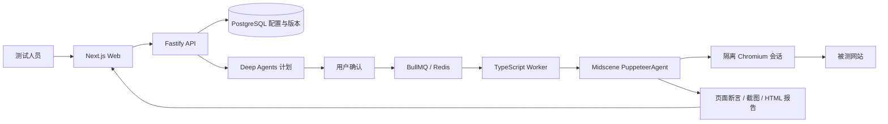

# TraceLab 网站自助测试开发与验证报告

> 2026-09-15 当前实现：已按最新要求切换为 **Midscene PlaywrightAgent + Playwright**，支持 Chrome（默认）、Edge、Firefox。网站及用例执行页可选择浏览器，运行快照固定选择供回归。下文 2026-09-14 的 Puppeteer 选择与历史验收记录已被此次迁移取代，当前实现与限制见 [运行手册](../docs/operations.md)。

版本：Web MVP v0.2.0 · 日期：2026-09-14。

已补齐网站管理、登录会话配置、功能 / 用例编辑和通用浏览器执行。用户从 Web 配置自己的网站并确认测试计划，后台通过 Deep Agents 和 Midscene 完成执行、页面断言及证据归档。核心开发语言为 TypeScript。

## 1. 使用入口

- 工作台：[网站管理](http://localhost:3100/#/websites)。
- 操作指南：[网站接入与测试指南](../docs/网站接入与测试指南.md)。
- 本机受邀账号：[访问文件](../.runtime/access.local.md)，本文不复制密码。
- 实现入口：[网站服务](../packages/websites/src/index.ts)、[Web 编辑器](../apps/web/components/websites.tsx)、[Midscene 驱动](../packages/executor/src/browser.ts)、[通用执行器](../packages/executor/src/web-case.ts)。

流程：添加网站 → 配置登录身份（访客可跳过）→ 添加功能和用例 → 选择用例并生成计划 → 确认执行 → 查看断言、截图和报告。

## 2. 本次实现

| 能力 | 当前行为 |
|---|---|
| 网站管理 | 名称、HTTP(S) URL、额外允许 origin、编辑、启停、配置版本；默认隐藏停用网站 |
| 登录会话 | 表单账号密码、Cookie / localStorage 导入、成功条件、有效期、启停；支持生成登录验证计划 |
| 凭证保护 | AES-256-GCM 加密，绑定网站；API 不返回秘密；登录阶段独立 Agent，不输出登录步骤报告 |
| 功能 / 用例 | 功能说明、入口、身份、前提、自然语言操作、点击、输入、等待、预期、清理；步骤排序及版本冲突检查 |
| 规划 | Deep Agents 只能选择用户选定的已保存用例；也支持直接采用目录计划；锁定步骤和预期 |
| 知识 | 从功能说明、前提、预期生成任务知识快照，关联规则与用例；保留审批样例 Wiki / 本体 |
| 执行 | 每条用例独立 Chromium context，Midscene 统一操作与页面断言，限制网站范围及预算 |
| 报告 | PASS / FAIL / BLOCKED / INCONCLUSIVE / SKIPPED，逐项断言、截图、Midscene HTML、事件和清理状态 |
| 平台兼容 | 原审批样例的 Skill 调试 / 发布、独立业务断言、幂等确认、取消、租约回收和授权继续可用 |

功能和用例改动只影响新任务；网站或会话变更、停用、过期会阻止旧配置继续执行。默认预算为 100 动作、60 次模型调用、150000 tokens、10 分钟。Midscene 内部动作也计入限制；单次请求消耗在返回后计量。

## 3. 技术架构和模型确认

实际依赖：Deep Agents 1.13.4、Midscene 1.12.6、Puppeteer-core 24.6.0、Next.js 16.3.5、Prisma 6.19.3、BullMQ 6.3.4。Puppeteer 管理浏览器、会话、网络范围和截图，所有 UI 点击、输入、等待及自然语言流程使用 Midscene。

项目已移除直接 Playwright 依赖、配置及测试运行器。源码、测试、脚本及 CI 没有直接 Playwright 调用；Midscene SDK 自带的其他平台适配依赖不参与执行。

本机 DeepSeek 服务的 `/models` 实际返回 `deepseek-flash`；真实图片请求成功识别页面字段。当前规划和视觉模型均使用 `deepseek-flash`，视觉 family 为 `deepseek`，网关为 `https://api.deepseek.com`。实际接口和成功执行证明该模型可用于本项目，早期缓存文档中的旧名称不作为否定依据。

实测修复了 Midscene 内联规划与 DeepSeek 坐标解析不一致的问题：自然语言动作使用 `deepThink: true`，让规划和定位分别执行；并修复登录验证重新打开登录页、localStorage 旧令牌覆盖刷新令牌的问题。

## 4. 验证结果

| 检查 | 结果 | 覆盖 |
|---|---|---|
| TypeScript、格式和生产构建 | 通过 | `pnpm typecheck`、`pnpm format:check`、`pnpm build` |
| 单元测试 | 14 / 14 通过 | 计划边界、业务反例、凭证加密、域名及会话校验、用例契约 |
| 集成测试 | 16 / 16 通过 | 先运行 15 项完整套件，再补充 1 项 localStorage 刷新与真实 Deep Agents 规划测试 |
| Midscene Web E2E | 2 / 2 通过 | 分别运行网站 → 用例 → 任务 → 报告，以及登录配置 → 验证计划 → 登录成功 |
| 运行健康 | 通过 | Web、API、样例服务、Redis、PostgreSQL 和 1 个 Worker |

全部视觉执行使用本机真实 `deepseek-flash`，未使用模型 mock 或 Playwright 替代。浏览器为本机 Edge Chromium。Web E2E 的界面操作也使用 Midscene，服务 API 仅作为结果核对及测试准备 / 收尾。

### 可核对的运行

| 场景 | 预期 / 实际 | 运行 ID |
|---|---|---|
| 访客商品查询 | PASS / PASS | `54ad7d3e-61eb-4419-a7e9-1f9d760c8abc` |
| 表单登录后查询 | PASS / PASS | `800c412c-815a-4e5e-b433-3ee32f9cf491` |
| Cookie 会话导入 | PASS / PASS | `11f5c6df-748f-44af-8d52-52f91fd73fd0` |
| 故意错误的页面预期 | FAIL / FAIL | `f4d9ddc0-6f31-4284-b035-b6216308dc3d` |
| 跳转到允许范围外 | BLOCKED / BLOCKED | `db7ee9d4-de35-412f-bd68-c89d2d93c467` |
| Web 创建网站并执行用例 | PASS / PASS | `12874106-6643-4727-8d61-063321468108` |
| Web 登录配置及验证 | PASS / PASS | `06e72539-b2c3-450a-a91c-99cab4087e1f` |
| localStorage 登录与令牌刷新 | PASS / PASS | `f0478f7e-ec05-48db-bb31-cc1d95705b9d` |

原始结果：[通用执行](../.runtime/verification/midscene-web.json)、[Web 操作](../.runtime/verification/web-midscene-e2e.json)、[Web 登录](../.runtime/verification/web-login-e2e.json)、[localStorage](../.runtime/verification/localstorage-midscene.json)。构建和单元日志位于 `.runtime/verification/build-midscene.log`、`unit-midscene.log`。截图保存在 `.runtime/screenshots`，运行证据在 `.runtime/evidence`；可在工作台运行历史查看。

测试使用独立临时商品查询网站，结束后停止临时服务并停用对应网站配置。审批清理异常测试保留了原故障结论，已按指定运行完成后续清理和审计。最初的集成运行因应用尚未就绪而连接失败；健康检查通过后完整 15 项重跑通过。网页登录自动填写曾误定位到“密码输入框描述”，明确目标后整条流程重新验证通过。

本次没有重跑旧版 36 次业务回归、20 项评测或 5 用户并发基线，不能用旧文件中的数字充当全 Midscene 版本成绩。

## 5. 运行和数据

最终版本采用生产构建运行，入口 3100，API 3101，审批样例 3102；项目 PostgreSQL 55432、Redis 56379。Worker 1 个，执行并发上限 2。电脑上原有数据库服务未变更。

已应用增量迁移 `202609140001_websites`，保留原有数据。升级前备份位于 `.runtime/backups/2026-09-14T00-39-07-314Z`。凭证加密依赖 `.env` 的 `SESSION_SECRET`；数据库备份不能代替该秘密的独立保管。

## 6. 当前边界

- 通用网站的 PASS 表示页面预期成立且证据已保存；后台事务、库存和账务仍需业务查询及确定性断言适配。
- 真实验证对象是独立测试商店和审批样例，尚未收到并验证用户的企业网站、正式 SSO 或内网 HTTPS。
- 清理只执行用户配置的步骤。含操作但没有清理时明确显示未配置；取消、停用或预算耗尽可能阻止 UI 清理。
- 每条用例使用一个登录身份。尚未提供自动 MFA / 验证码、浏览器人工接管、多标签页、上传和多浏览器兼容。
- 自定义 Skill 的现有闭环适用于审批样例；通用网站 Skill、完整 Wiki 摄取编辑、MCP 自助工具和脚本运行器仍按后续迭代实现。
- 视觉费用暂显示未知，应用预算不能替代供应商计费硬限额。容器和企业部署模板尚未在本机完成容器实测。

本次交付可供用户通过本机 Web 体验和接入测试网站；企业发布与真实用户试用验收仍须在对应部署环境完成。
