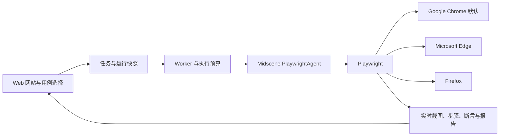

# WeUI · Playwright 多浏览器适配与验证

2026-09-15。本次按最新要求将执行底层从 Puppeteer 切换到 Playwright，保留 Midscene 作为 UI 操作与视觉断言引擎。支持 Google Chrome（默认）、Microsoft Edge、Firefox，界面不列出 Safari / WebKit。

## 使用方式

1. 在“网站管理”设置网站的默认测试浏览器。旧网站和新建网站均默认 Chrome。
2. 在“用例库”或“运行测试用例”选择本次浏览器，点击立即测试或运行所选用例，无需改写用例。
3. “执行过程回看”与“可追溯运行快照”显示本次浏览器。一键回归固定使用同一浏览器。
4. 网站探索沿用网站默认浏览器；草稿审核发布后，也可以选择其他浏览器正式执行。

## 实现

- 版本固定：Midscene 1.12.6、Playwright 1.63.0；移除项目中的 Puppeteer 直接依赖、类型和调用。上游 Midscene 包仍包含其他适配器的间接依赖，不代表本项目使用它们执行。
- `Environment.config.browser` 保存默认值；`Task.browserSnapshot.browserName` 和 `Run.manifest.browser` 保存执行选择，幂等键同时绑定浏览器选择。旧数据不需要迁移。
- Chrome、Edge 分别发现安装路径；Firefox 使用 Playwright 专用构建。浏览器缺失时明确报错，不回退到其他品牌。
- 登录、Cookie、localStorage 恢复、会话隔离、截图预览、取消与回收均已迁移到 Playwright API。
- Firefox 的输入清空采用 Midscene 设备适配器中的 Playwright 原生鼠标/键盘操作，保留视觉定位、动作审计与报告。空字符串输入显式转换为 Midscene clear 模式，避免 SDK replace 模式忽略空值。
- 域名约束同时应用到 Playwright 请求路由和每会话独立代理，防止 HTTP 重定向绕过允许范围。代理的 HTTP 连接池、凭证和连接均随会话回收；HTTPS 通过受限 CONNECT 转发，不解密网页流量。
- 浏览器后台联网被阻断不再被误判为业务页面越域。登录画面继续隐藏；副作用未知及业务清理失败的重跑约束保留。

## 验证结果

在本机 Windows、真实 deepseek-flash 模型下验证，全部使用独立测试网站，结束后停用测试网站，保留执行证据。未修改 CC-TRADE 网站配置或业务数据。

| 验证 | 结果与证据 |
|---|---|
| 类型检查、生产构建 | `pnpm build` 通过 |
| 单元测试 | 38 项通过，包含浏览器默认值、品牌选择、缺失不回退、启动重试和取消 |
| 三浏览器会话与访问范围 | Cookie 隔离、只读 POST 阻断、越域请求和重定向阻断；范围外服务器收到 0 次请求 |
| 三浏览器 HTTPS | Chrome、Edge、Firefox 均成功访问 HTTPS 页面，证书验证保持开启 |
| 三浏览器正式运行 | 输入、清空、等待、自然语言点击、断言、截图、Midscene 报告、清理均通过 |
| Firefox 回归 | 网站默认 Edge 时，Firefox 原运行的一键回归仍使用 Firefox，通过 |
| 登录 | Chrome 表单登录；Edge 异步登录等待；Firefox localStorage 恢复且保留网站轮换令牌，均通过 |
| 过程展示与正反例 | 登录隐藏、真实 JPEG 预览、步骤与断言证据、错误预期得到 FAIL、原用例回归得到 PASS |
| Firefox 探索闭环 | 主链路、边界、发散三阶段；Chrome Web 界面人工校准发布后在 Firefox 正式执行，通过；探索写入与删除均为 0 |
| Web 浏览器选择 | 默认 Chrome；保存 Firefox；本次改为 Edge；实际运行和报告显示 Edge，通过 |

主要证据文件：

- `.runtime/verification/browser-choice.json`：Chrome `3a25bfd3-6a10-4131-b1c5-0c0ae6bdec96`、Edge `1efbaf20-7ea9-47d6-9105-e8dfbf7874cc`、Firefox `44479562-0f03-40a1-a4d4-358021d6494d`、Firefox 回归 `1c525a6c-a216-4b7c-b0e6-a3d71e1ba934`。
- `.runtime/verification/browser-choice-ui.json`：保存浏览器、切换本次浏览器和报告显示的 Web 实测。
- `.runtime/verification/case-runs.json`：Chrome 正常运行、反例、实时过程和一键回归。
- `.runtime/verification/discovery-flow.json`：Firefox 探索 `70627c5b-6759-4cff-bffb-e960e5726708`；审核发布后的正式运行 `180c9ffa-7740-4219-8eae-05a2fea8533f`。
- `.runtime/verification/localstorage-midscene.json`、`.runtime/verification/chrome-async-login.json`：Firefox 存储会话和 Edge 异步登录（后者保留历史文件名）。

## 当前范围

最终已重新构建并启动生产服务：[WeUI 工作台](http://localhost:3100)。Web 3100、API 3101、审批样例 3102、Redis、PostgreSQL 和 Worker 健康检查全部通过。最终复核 11 条持久化运行记录均使用 Playwright；当前无未结束的验证任务，验证网站均已停用，仅原有 CC-TRADE 网站保持启用。汇总保存在 `.runtime/verification/playwright-final.json`。

Firefox 支持本轮验证的桌面鼠标、键盘、输入、滚动、截图、视觉断言与探索流程；不提供触摸手势、CDP 录屏或多标签浏览器级自动跟随。原生下拉弹出层等操作仍受各浏览器截图呈现影响，不能据此声称任意控件均已兼容。

Chrome 152.0.7977.83、Edge 153.0.4234.32、Playwright Firefox 155.0 已实测。Firefox 下载与路径说明见 [运行手册](../docs/operations.md)。Docker 配置已适配，但容器目标环境未实测。
