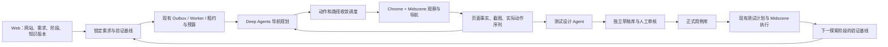
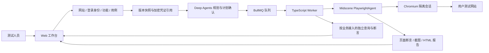
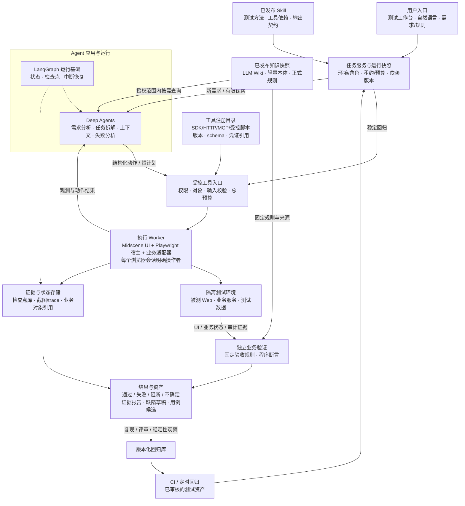
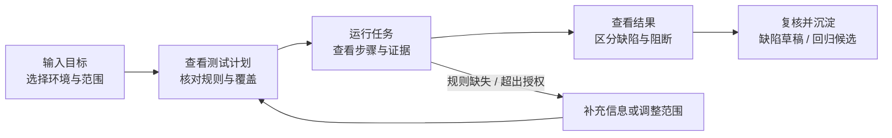
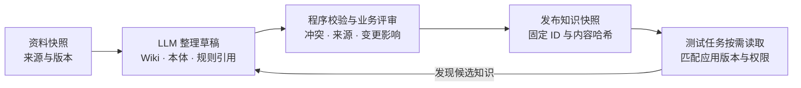
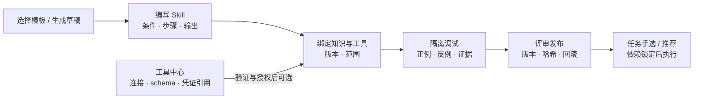

# UI Agent 架构、使用方式与预期效果

> 2026-09-15 当前实现：已按最新要求切换为 **Midscene PlaywrightAgent + Playwright**，支持 Chrome（默认）、Edge、Firefox。网站及用例执行页可选择浏览器，运行快照固定选择供回归。下文 2026-09-14 的 Puppeteer 选择与历史验收记录已被此次迁移取代，当前实现与限制见 [运行手册](../docs/operations.md)。

2026-09-14 探索功能更新：已实现“网站 + 需求 → 受控探索 → 带来源和截图的草稿 → 人工校准与审核发布 → 正式测试”。探索采用主链路、边界、发散三阶段，以上一阶段的正式结果作为准入基线；导航调度包含动作重复拦截、页面状态比较、路径新颖度排序。当前探索观察与导航由 Chrome + Midscene 执行，表单填写、提交和负向验证在审核后的正式用例中执行。详见 [探索与审核指南](../docs/网站探索与用例沉淀.md)。

版本：v1.3 | 更新日期：2026-09-14 | 对齐 Web MVP v0.2。

**当前实现变更**：按用户确认，UI 执行统一改为 Midscene，移除项目直接使用的 Playwright 和其测试运行器。已补齐网站、登录会话、功能用例管理及通用浏览器执行；下文涉及旧执行选型的内容属于历史设计，以本段和 [网站接入指南](../docs/网站接入与测试指南.md) 为准。页面断言与后台业务验真保持明确区分。

本文保留完整平台设计及早期原型说明，尚未接入企业业务系统。2026-09-14 的 Web MVP 已支持用户自行配置网站、会话及用例，入口 http://localhost:3100。真实验证覆盖审批样例和独立通用测试商店，见 [README](../README.md) 和 [v0.2 验证报告](Midscene网站自助测试开发与验证报告.md)；后文旧原型仍使用演示数据。

## 1. 产品定位

用户提供业务目标、规则和测试范围，UI Agent 生成可审阅的测试计划，在获准环境执行，输出有证据的结果与可复用资产。业务 QA 主要操作测试工作台；研发通过缺陷与证据定位问题；测试开发负责工具、数据和断言适配；已审核回归由 CI 触发。

核心语言为 **TypeScript**，产品入口为 Web。当前组合：**Deep Agents + Midscene SDK + Playwright 浏览器宿主**。Deep Agents 组织规划与知识；Midscene 执行全部 UI 操作和页面断言；Playwright 管理浏览器生命周期、会话与截图。后台业务结论需要独立查询与断言。

知识组织采用 LLM Wiki + 轻量领域本体 + 独立断言。测试人员可以从模板创建 Skill、关联已接入工具并在隔离环境调试；发布后供项目任务使用。知识库、Skill 与工具均锁定版本，并通过同一运行清单关联。当前 MVP 已实现知识和工具只读目录、文本 Skill 编辑、调试、发布与回退；完整 Wiki 摄取/编辑、MCP 自助接入和脚本运行器按后续迭代交付。

## 2. 系统架构图

图中是完整平台的逻辑职责，分期边界见《MVP开发任务清单与迭代路线》。MVP 采用一个 TypeScript 仓库，Web（Next.js）、API（Fastify）、Worker 分进程运行，数据库保存任务和事件，队列分发作业。浏览器从第一版起独立于 HTTP 请求，关闭页面不结束后台任务；MVP 崩溃恢复保证留证与明确终态，原浏览器现场恢复不作承诺。

任务服务在开始执行前固定知识、Skill、工具和断言制品版本。Skill 只提供方法，工具注册描述具体能力，实际权限在调用入口和执行侧校验。原始资料和运行观察不会自动获得修改规则或扩大工具权限的能力。

模型接入统一经过企业获准的模型网关：Deep Agents 使用适合分析与工具调用的模型，Midscene 使用经验证的视觉模型。两者的费用、调用次数和总时长统一计量。存储层分别保存任务检查点、证据文件和版本化资产；活的浏览器对象不写入检查点。

### 核心边界

- Deep Agents 拆解业务任务；Midscene 执行定位、单步或短流程，避免两层无限规划。
- 模型生成计划、用例与缺陷候选；业务预期和关键断言由受控规则决定。
- 知识维护写候选区，正式任务读已审核快照；新发现不能改变本次运行的预期。
- Skill 声明依赖，平台校验实际权限；包括框架预置工具在内的所有调用均纳入范围和预算控制。
- 任务中已授权的普通测试操作直接执行；规则不明、超出范围或写入状态无法确认时暂停并定位原因。
- 同一页面只有明确的操作者；并行任务隔离会话、账号和数据。子 Agent 优先承担不共享页面状态的分析工作。
- 失败恢复先查询业务副作用；无法确定是否已提交时不得盲目重放。
- 缺陷发布、资产入库和发布门禁遵循企业流程；演示中的草稿不等于已经发送或合并。

## 3. 用户怎么使用

### 业务 QA：从一句目标开始

示例输入：

> 验证申请创建与审批流程。申请人不能审批自己；重复提交不能生成两张单据；检查跨角色权限，并核对页面与后端状态一致。使用集成测试环境和本次任务创建的数据。

| 用户步骤 | 工作台呈现 | 用户需要做什么 |
| --- | --- | --- |
| 输入目标 | 业务描述、规则引用、环境、账号角色与数据范围 | 说明要验证什么；不要求先写定位器 |
| 查看计划 | 正常、边界、权限、异常场景，以及各自预期 | 检查业务预期与范围；有歧义才补充信息 |
| 运行任务 | 当前步骤、浏览器观察、已完成断言、预算与阻断原因 | 按需观察；必要时取消或处理明确的补充请求 |
| 查看结果 | 用例状态、预期/实际、最小复现、截图与业务证据 | 确认问题性质，查看失败与阻断的处理建议 |
| 沉淀资产 | 缺陷草稿、测试代码候选、数据准备与清理说明 | 评审后进入现有缺陷和回归流程 |

计划页同时显示关联规则与来源、知识发布版本、选用 Skill 及工具依赖；缺规则或版本不兼容时，给出具体补充项。结果页保留这些引用，支持复现与变更影响分析。以上是界面下一阶段的设计要求，当前演示数据不代表真实知识查询。

首次接入业务系统时，测试开发仍需准备账号、数据工厂、业务查询接口和断言。自然语言入口建立在这些能力之上，不意味着任意系统零配置即可可信测试。

### 知识维护者：从资料到发布快照

知识页提供来源、关联规则/用例、审核状态、适用版本和变更差异。用户新增或替换需求后，系统给出候选变更和受影响用例；冲突未解决时不进入正式快照。原始资料保留，规则与 Wiki 的权威范围清晰。

### 测试人员：自定义 Skill 并接入工具

技能库展示适用场景、维护人、版本、依赖和验证状态；编辑器提供模板与差异；调试台展示实际知识/工具选择、输入输出、断言和费用；工具中心管理 SDK/函数、HTTP、MCP 与受控脚本。普通 QA 可编写方法并复用已接入工具，新增连接与代码按工具流程验证后开放。详细契约见总方案第 18 节；MVP 交付 Web 文本 Skill 编辑/调试/发布与 SDK/HTTP，MCP 和完整工具接入界面在 v0.2 交付。

### 另外三种入口

| 使用者 / 场景 | 触发方式 | 得到的结果 |
| --- | --- | --- |
| QA 验证新需求 | 选择需求与业务规则，生成候选计划 | 风险覆盖清单、候选用例、执行证据 |
| 研发复现问题 | 提供任务 ID、版本和缺陷线索 | 最小复现步骤、关联日志、实际与预期差异 |
| CI 稳定回归 | 运行已审核测试集 | 确定性结果和门禁状态；失败不自动改断言 |

## 4. 用户看到的效果：一次任务的示例

以下规则、编号和状态均为演示数据。5 个场景得到 3 个通过、1 个失败、1 个阻断；这些数字仅解释结果界面，不是系统成功率或实测能力。

| 用例 | 业务预期 | 示例结果 |
| --- | --- | --- |
| 正常提交与审批 | 页面、持久化状态和审批审计一致 | 通过：三类证据一致 |
| 申请人审批本人申请 | 服务端拒绝，申请状态不改变 | 通过：拒绝生效，原状态保持 |
| 重复提交 | 相同业务请求只产生一张单据 | 失败：查询到 DEMO-102-A 与 DEMO-102-B 两张单据 |
| 无权角色审批 | 无审批权限的角色不能完成审批 | 通过：权限校验生效 |
| 审批依赖不可用 | 环境就绪后才能验证正常审批 | 阻断：依赖健康检查失败，未判产品通过或失败 |

失败详情应直接回答四个问题：测试依据是什么；做了哪些操作；预期与实际哪里不同；证据在哪里。重复提交示例将业务数量断言“预期 1、实际 2”与两次提交、请求关联信息及对象查询记录放在一起。定位结果不足时显示待分析，而非编造根因。

用户最终拿到：可复核的结果报告、包含规则与证据的缺陷草稿，以及附带数据准备和清理要求的回归用例候选。任务存在关键失败或必测阻断时，发布门禁显示未满足条件。

## 5. 什么效果可以预期，什么要实测

| 建设后的预期变化 | 用什么衡量 |
| --- | --- |
| QA 从逐步写脚本，转向确认目标、预期与覆盖 | 端到端人工工时，包括评审、修复和维护 |
| 页面操作与业务验收证据集中展示 | 从失败报告到明确归因的人工时间 |
| 探索发现可以进入回归流程 | 经评审、复现与稳定性观察后的资产验收率 |
| 环境阻断与产品缺陷分别处理 | 分类准确性、误通过、误失败及阻断比例 |
| 模型和工具开销可追踪 | 每个有效用例费用、p50/p95 时延与总预算超限情况 |
| 知识更新能定位规则与受影响用例 | 来源与版本准确性、影响分析漏检、总维护工时 |
| QA 可复用方法并自定义 Skill | 从草稿到可用的工时、误启用、发布与回滚结果 |

总方案中“人工工时下降至少 20%”属于试点目标。是否达到、覆盖是否改善、长期维护是否更便宜，必须通过企业代表任务的对照运行确认；本次架构与交互示意不提供实际收益结论。

## 6. 技术依据

架构分层、工具契约、界面流程与示例结果为本项目设计建议。框架能力依据如下：

- [Deep Agents 概览](https://docs.langchain.com/oss/javascript/deepagents/overview)：应用开发入口与通用 Agent 能力。
- [Deep Agents 上下文管理](https://docs.langchain.com/oss/javascript/deepagents/context-engineering)：历史压缩和大型结果处理。
- [LangGraph 持久化](https://docs.langchain.com/oss/javascript/langgraph/persistence)：检查点与跨任务存储。
- [Midscene 集成 Playwright](https://midscenejs.com/zh/integrate-with-playwright)：共享浏览器执行基础。
- [Playwright Assertions](https://playwright.dev/docs/test-assertions)：程序断言与等待事实。
- [Playwright API testing](https://playwright.dev/docs/api-testing)：数据准备与业务后置条件验证。
- [LLM Wiki 原始方案](https://gist.github.com/karpathy/442a6bf555914893e9891c11519de94f)：知识整理与持续维护模式。
- [Agent Skills 规范](https://agentskills.io/specification)：Skill 包与元数据格式。
- [MCP Tools](https://modelcontextprotocol.io/specification/2025-06-18/server/tools)：工具发现与调用协议。

## 2026-09-15：简洁测试闭环落地更新

默认主流程调整为“探索生成草稿 → 人工校准发布 → 勾选用例直接测试 → 可视化结果 → 一键回归”。用例库支持单条与批量直跑；选择网站沿流程保留。已有用例不再要求目标规划和额外计划确认，知识、Skill、Agent 目标规划保留在高级入口。

运行页新增约 2 秒刷新的真实 Chrome 画面、步骤状态、实时验证结论与关键截图回看；认证阶段隐藏凭据画面。直跑自动冻结版本并保留幂等、权限、未知结果和清理检查；回归复用原快照，修改后从用例库创建新测试。

实现范围、架构和真实验证证据详见 [简洁测试闭环与可视化验证](简洁测试闭环与可视化验证.md)。
