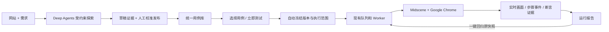

# 简洁测试闭环与可视化验证 · 2026-09-15

## 用户入口

主流程收敛为“探索用例 → 用例库校准 → 执行与回归”。“运行测试”默认选择已保存用例，不要求额外填写目标或等待 Agent 再次规划。

1. **探索**：网站与需求文档生成有页面证据的草稿。主链路、边界、发散阶段和操作 / 路径收敛保持生效。
2. **校准**：人工修改步骤、登录身份、预期、清理，保存后审核发布。发布后的用例与手动用例统一进入用例库。
3. **执行**：用例库单条测试、功能内批量测试、全站勾选测试；探索详情可测试当前、全部发布或选定子集。
4. **查看**：运行中显示实际 Chrome 画面、当前动作、逐步状态、每项验证；结束后按用例回看步骤和断言截图。
5. **回归**：运行页一键回归原版本。修改后的用例通过“运行测试”创建新版本运行；测试记录点击直接进入最近运行。

网站选择在探索、用例库和运行入口之间保留。知识、Skill、Agent 目标规划、预算等集中在高级选项中。

## 实现边界

- `POST /api/case-runs`：最多 12 条用例，检查项目、网站、启用状态、登录配置和预算；请求幂等覆盖 Task、Plan、Run。正式执行继续经过原有权限、版本、未知结果和清理保护。
- 未审核的探索草稿不是 WebCase，无法直接选择执行。同一请求的重试不能换用例或预算；相同网站与用例的前次运行未结束或结果未知时，不能通过另建直跑任务绕过保护。
- 用例直跑固定执行用户选定的保存版本，不调用规划模型。原有 Deep Agents 目标规划仍可从高级选项进入。
- 实时预览约 2 秒采集一张 JPEG，Redis 只保留最新帧，24 小时过期。认证输入阶段仅向前端发布隐藏状态，不向前端预览接口发送登录画面；读取每次检查登录与项目权限，禁止 HTTP 缓存。Midscene 仍按配置使用视觉模型完成登录。预览故障不替代或中断执行结果。
- 操作完成后保存步骤截图，断言与结束时保留证据及 Midscene 报告。预览是实时截图，回看是关键帧，不是录像或人工控制浏览器。
- 自定义网站结论是页面验证。后台业务持久化需要另行接入独立证据工具，不能由页面成功提示推断。

## 本次真实验证

使用独立临时测试网站、Google Chrome、Midscene 与本机已配置的视觉模型，未修改用户业务网站数据。

| 验证 | 结果 |
| --- | --- |
| 27 项已有单元测试 | 通过 |
| 生产构建与 TypeScript 检查 | 通过 |
| 同请求并发直跑三次 | 仅生成一次运行 |
| 最终版本接口并发直跑五次 | 仅生成一次运行，知识快照与任务创建无竞态冲突 |
| 跨项目用户读取预览 / 提交测试 | 403，匿名读取预览为 401 |
| 前次未知写入结果 | 新建直跑也被拒绝，保护不能绕过 |
| 样例显式选择 C04 | 仅冻结所选用例及其原始预期，不调用规划器 |
| 停用 / 重复 / 未发布用例 | 接口拒绝 |
| 登录阶段隐藏画面、业务阶段真实 JPEG | 通过 |
| 输入 + 点击步骤事件、步骤截图、页面断言 | 通过 |
| Chrome Web 勾选子集后直接运行 | 仅运行所选用例 |
| 故意设置错误预期 | FAIL，显示实际页面与不成立原因 |
| Chrome 点击一键回归 | PASS，沿用原 planHash 与用例 revision |
| 回看步骤截图与结果 | Chrome UI 验证通过，无页面脚本错误 |
| 真实探索、人工修改保存、审核发布、点击正式测试 | 通过，正式测试不再调用规划模型 |
| 主链路、边界、发散三阶段 | 通过，探索业务写入及删除次数均为 0 |

证据索引：

- `.runtime/verification/case-runs.json`：直跑 `fd6f4aa9-d8aa-4388-aa2a-83ad358109b1`，错误预期 `43641e75-d480-4f9b-9bd8-f72a4d30cfe4`，回归 `41a52056-b7d5-4b3a-9878-31797152ab5f`。
- `.runtime/verification/discovery-flow.json`：探索 `9d5884b5-e7f6-444b-bbc4-36edbb0c4646`，审核后直跑 `a75614b0-01d3-4ae7-9c7b-3252a3fec276`。
- `.runtime/screenshots/case-selection-chrome.png`：选择用例界面。
- `.runtime/screenshots/case-live-chrome.png`：执行中真实浏览器画面与步骤状态。
- `.runtime/screenshots/case-replay-chrome.png`：执行结束后的关键截图回看。
- `.runtime/screenshots/discovery-published-chrome.png`：人工审核发布结果。

临时验收网站在验证后停用，历史报告保留供查看。

## 2026-09-15 补充：分页、右侧编辑与重复运行诊断

- 用例库、运行选择页新增 10 / 20 / 50 条分页，搜索重置页码，跨页保留勾选，批量执行上限仍为 12。
- 编辑和新建在右侧原生模态抽屉中进行；支持独立滚动、键盘焦点约束、关闭后返回、未保存修改提醒，保存后关闭并保持列表页码。
- 重复运行错误改为持久提示，带历史运行链接、具体执行原因及编辑入口。服务端返回限定的运行 / 用例引用，不返回凭据。
- 修复同批次误拦：网站用例直跑按所选 caseId 检查前次动作与结果，未执行或仅认证被阻断的用例可独立运行；整批回归及真实未知写入、清理失败保护保持生效。同一历史批次混选安全和异常用例仍拒绝，不因检查顺序漏检。
- 实际历史 `15517d90-e0c4-44c7-b960-d835c1edbc02` 只读核对：旧“登录”存在重复登录、无明确凭据及正反预期混用，动作中断后整次预算耗尽。旧异常用例仍受保护，已有“登录成功（已保存身份）”和“错误账号登录提示（访客）”可独立发起。未修改该用户用例或历史结论。
- 新增 `tests/e2e/case-library.test.ts`，使用 13 条独立临时用例验证分页、跨页选择、右侧抽屉保存与放弃提醒。新增 2 项范围单测，并扩展接口保护测试覆盖混选顺序和未执行用例独立运行。

补充验证结果：29 项单元测试、扩展的直跑接口保护测试、真实 Chrome 分页与抽屉 E2E 均通过。临时网站包含 13 条用例，验证 10 条分页、20 条切换、跨页选择、校准保存版本 v2、未保存继续编辑 / 放弃、空白新建抽屉。证据：`.runtime/verification/case-library.json`、`.runtime/screenshots/case-drawer-chrome.png`、`.runtime/screenshots/case-pagination-chrome.png`。验收网站 c56bf1f9-bf32-48e9-85ba-6442056e929d 已停用，未修改用户网站数据。

## 2026-09-15 补充：报告下载、模型价格与反馈查看

普通网站用例只在最终保存完整 Midscene HTML 报告，各步骤和断言仍保存截图。旧报告默认展示一个主下载按钮，阶段附件折叠保留并标明断言或阶段。

空间设置增加模型价格表，管理员可保存，普通成员只读。已核验并初始化 DeepSeek Flash 官方 USD / 百万 Token 价格（2026-09-15）：高峰输入未命中 0.30、命中 0.006、输出 1.20；空闲分别为 0.15、0.003、0.60。按北京时间工作日 09:00–12:00、14:00–18:00 判断高峰。来源：https://api-docs.deepseek.com/quick_start/pricing/ 。此为人工核验的官方快照，未配置定时同步。

规划、探索及视觉执行统一按用量增量估算费用，保存模型、价格、来源与时段。缓存未知按未命中计价。修改价格不会覆盖既有运行明细；旧记录只在模型假设明确时提供历史参考。回归不重复计入已保存计划的规划费用。

反馈落在本平台 PostgreSQL 的 Feedback 表。新增运行内反馈列表和空间级「反馈记录」，显示作者、时间、评分、类型、正文和原运行链接；支持类型过滤、服务端分页及项目授权。原机器结论保留，无外部工单或邮件发送。

验证结果：

- 34 项单元测试通过；类型检查及生产构建通过。
- `tests/integration/report-tools.test.ts` 通过：真实 Chrome + Midscene 两次断言，保留 3 张截图和 1 份最终报告；费用估算 `$0.0010461`（USD）。运行 `9884f34e-d586-4275-b30b-8f428cc66957`。
- 验证非管理员改价被拒、重复/负数价格校验、陈旧版本保存冲突、价格持久化及运行快照不被改写。
- 验证匿名/跨空间访问反馈与费用被拒，空间成员可以读取；11 条反馈跨页无重复，Chrome 成功提交、读取、筛选反馈并保存官方价格。
- 历史运行 `fd6f4aa9-d8aa-4388-aa2a-83ad358109b1` 的 2 份报告折叠为 1 个主入口；Chrome 展开阶段附件和计价说明通过，HTML 下载响应正常，原 usage 未改变。
- 临时网站均停用，本次创建的 36 条测试反馈已清除，用户反馈保留。

证据：`.runtime/verification/report-tools.json`、`.runtime/verification/legacy-report.json`；截图 `report-feedback-chrome.png`、`feedback-list-chrome.png`、`model-pricing-chrome.png`、`legacy-report-chrome.png` 位于 `.runtime/screenshots/`。

## 2026-09-15 补充：WeUI 名称与人民币估算

平台名称按用户指定统一为 **WeUI 智能 UI 测试平台**。副标题为“网站探索 · 用例校准 · 自动执行 · 回归验证”。登录页、导航品牌、浏览器标题、页脚、设置页和当前操作文档同步更新；介绍准确描述需求与页面观察、测试草稿、人工校准、真实浏览器执行与截图证据，避免泛化为所有后台业务均已核验。

费用改为人民币（元），单价单位为百万 Token，报告使用 `¥`。按 DeepSeek 中文官方价格直接估算：高峰输入未命中 2 元、缓存命中 0.04 元、输出 8 元；空闲分别为 1 元、0.02 元、4 元。来源：https://api-docs.deepseek.com/zh-cn/quick_start/pricing/ 。旧官方美元配置归档后更新为人民币；新费用记录带币种和 `costCny`，旧 `costUsd` 保持原意。历史美元报告根据已有模型、Token、缓存和时间重新计算人民币参考费用，原始记录不变，不使用固定汇率换算。

验证：36 项单元测试、类型检查及生产构建通过；Chrome + Midscene 报告、人民币价格保存及费用显示流程通过。WeUI 登录页在 1440px 桌面和 390px 手机宽度检查通过，无横向溢出。旧运行的 `$0.0010461` 记录保留，依据 Token 得到人民币参考 `¥0.006974`。本轮临时网站停用，临时反馈删除。

证据：`.runtime/verification/weui-cny.json`、最新 `.runtime/verification/report-tools.json`；登录页截图 `.runtime/screenshots/weui-login-chrome.png`、`.runtime/screenshots/weui-login-mobile.png`。
